# 2.3. Phân tích yêu cầu

## 2.3.1. Quản lý khóa học và bài giảng

### Hình 2.1: Sơ đồ Use case quản lý khóa học và bài giảng

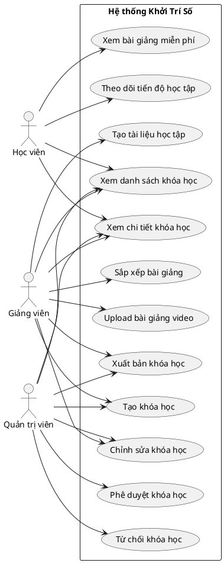

### Hình 2.2: Sơ đồ hoạt động quy trình tạo và phê duyệt khóa học

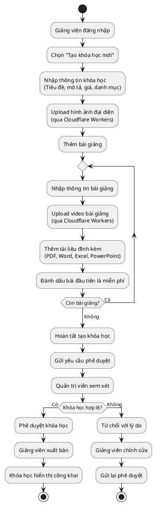

### Hình 2.3: Sơ đồ tuần tự các bước trong quy trình học viên xem khóa học

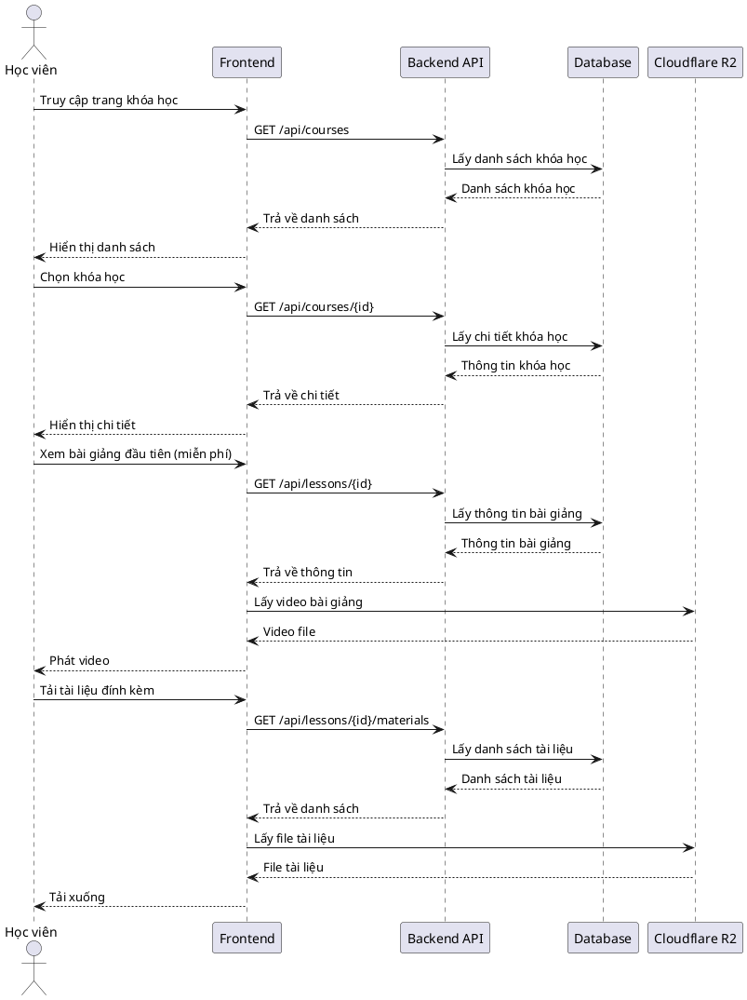

## 2.3.2. Quản lý sách điện tử

### Hình 2.4: Sơ đồ Use case quản lý sách điện tử

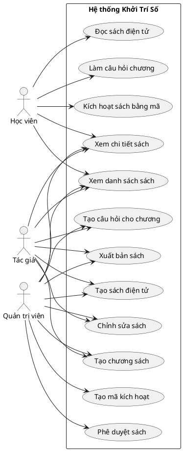

### Hình 2.5: Sơ đồ hoạt động quy trình tạo và đọc sách điện tử

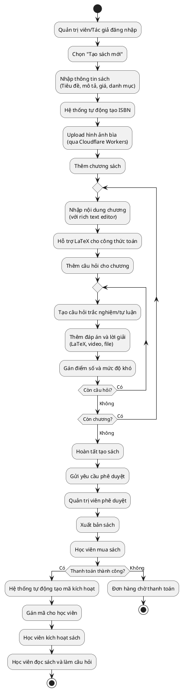

### Hình 2.6: Sơ đồ tuần tự quy trình học viên mua và kích hoạt sách

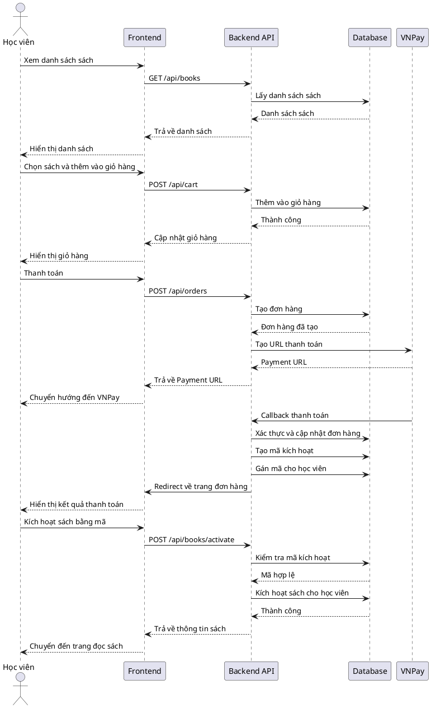

## 2.3.3. Quản lý đơn hàng và thanh toán

### Hình 2.7: Sơ đồ Use case quản lý đơn hàng và thanh toán

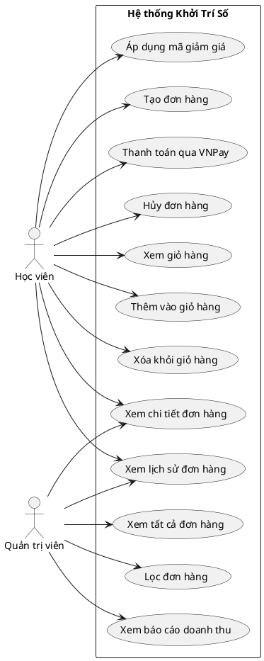

### Hình 2.8: Sơ đồ hoạt động quy trình đặt hàng và thanh toán

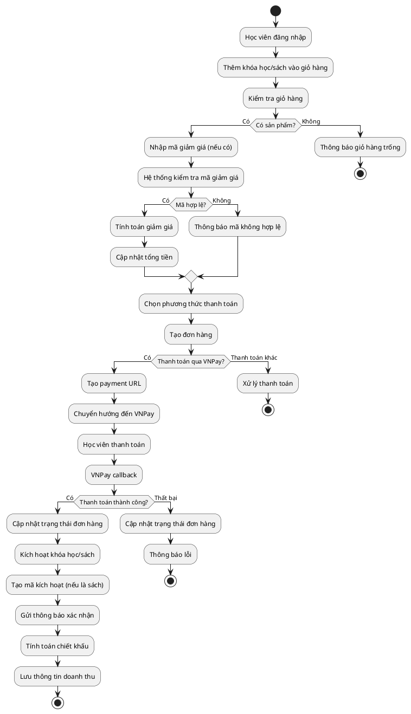

### Hình 2.9: Sơ đồ tuần tự quy trình thanh toán qua VNPay

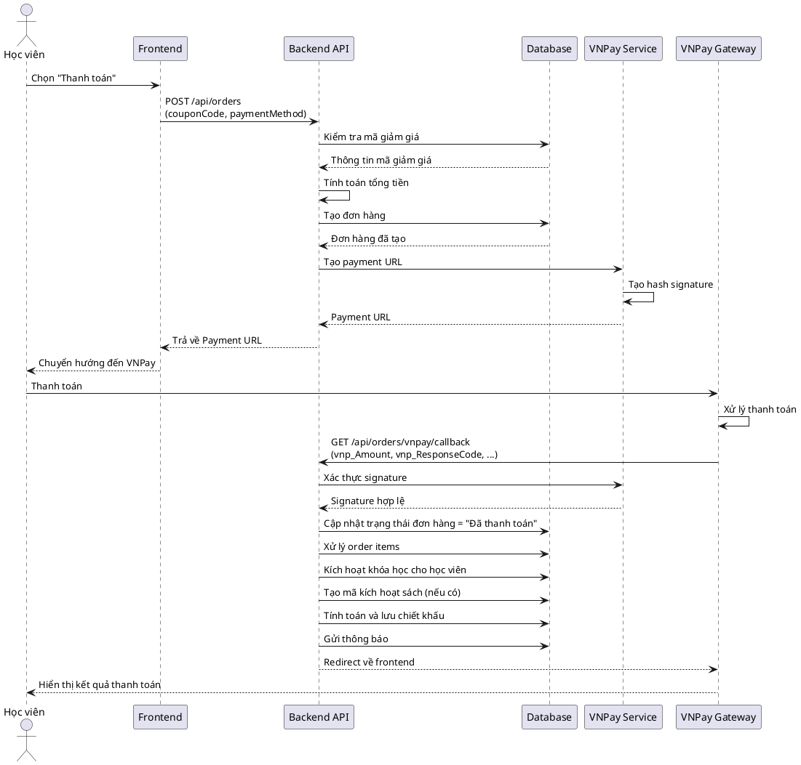

## 2.3.4. Quản lý câu hỏi và đánh giá

### Hình 2.10: Sơ đồ Use case quản lý câu hỏi và đánh giá

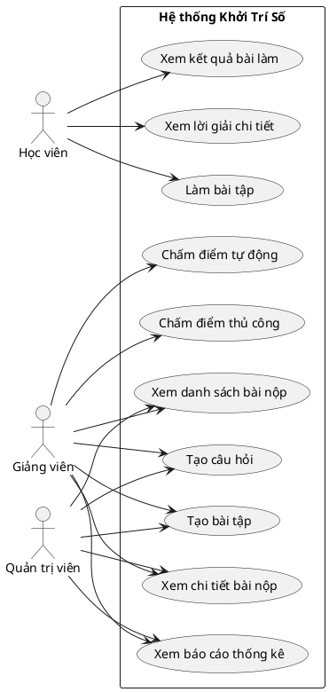

### Hình 2.11: Sơ đồ hoạt động quy trình làm bài tập và chấm điểm

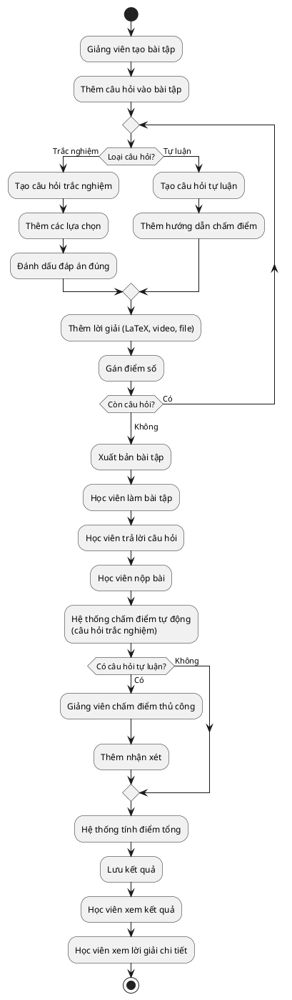

### Hình 2.12: Sơ đồ tuần tự quy trình học viên làm bài tập

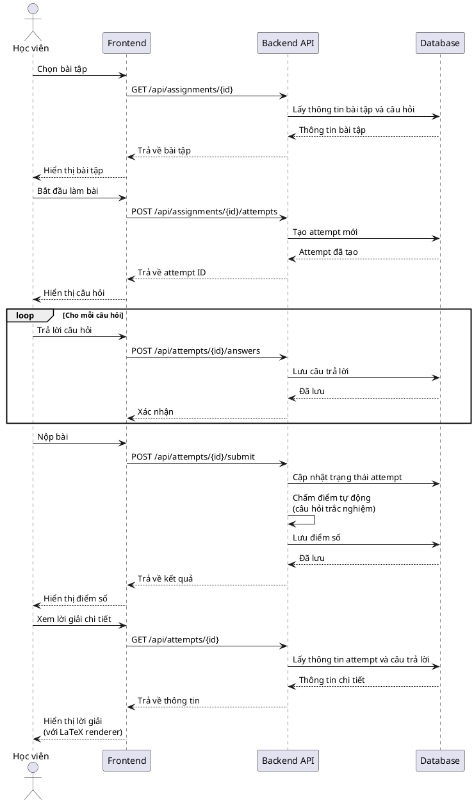

## 2.3.5. Quản lý lớp học trực tuyến

### Hình 2.13: Sơ đồ Use case quản lý lớp học trực tuyến

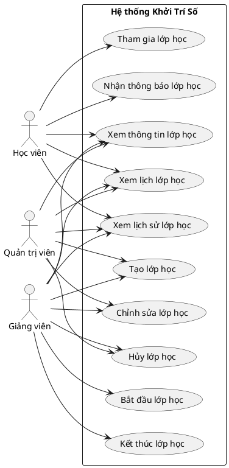

### Hình 2.14: Sơ đồ hoạt động quy trình tạo và tham gia lớp học trực tuyến

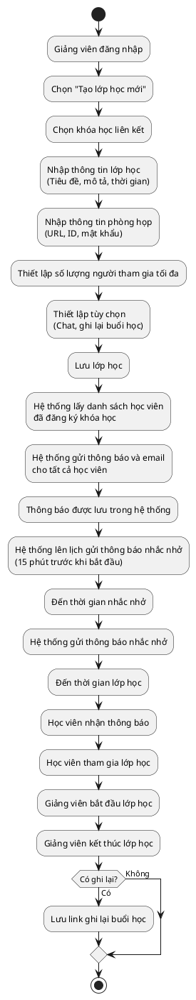

### Hình 2.15: Sơ đồ tuần tự quy trình tạo và gửi thông báo lớp học

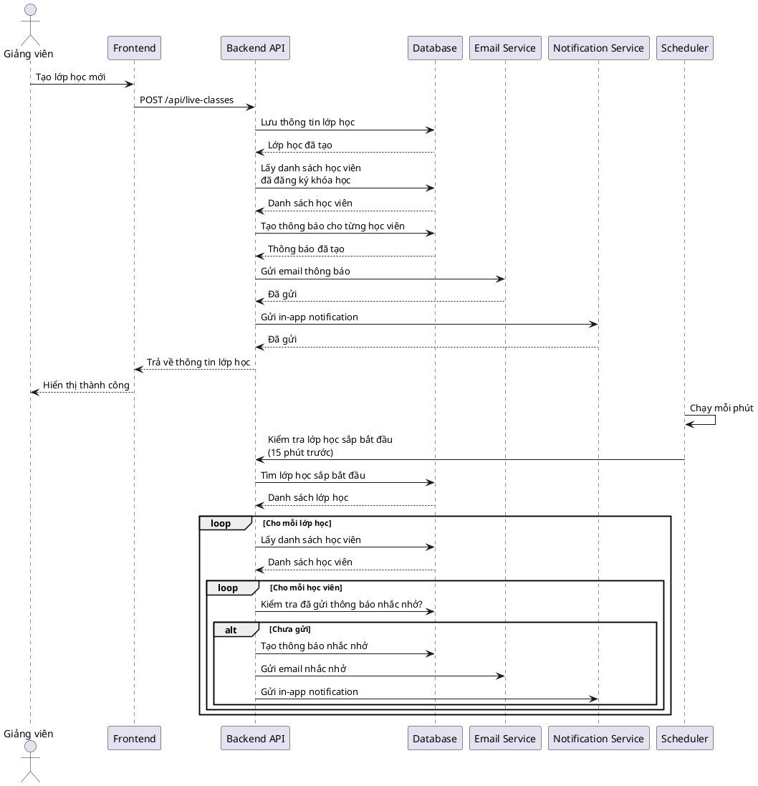

## 2.3.6. Quản lý báo cáo và thống kê

### Hình 2.16: Sơ đồ Use case quản lý báo cáo và thống kê

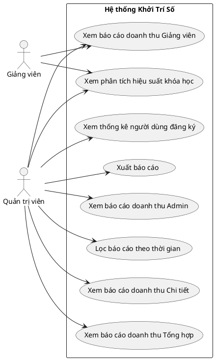

### Hình 2.17: Sơ đồ hoạt động quy trình xem báo cáo doanh thu

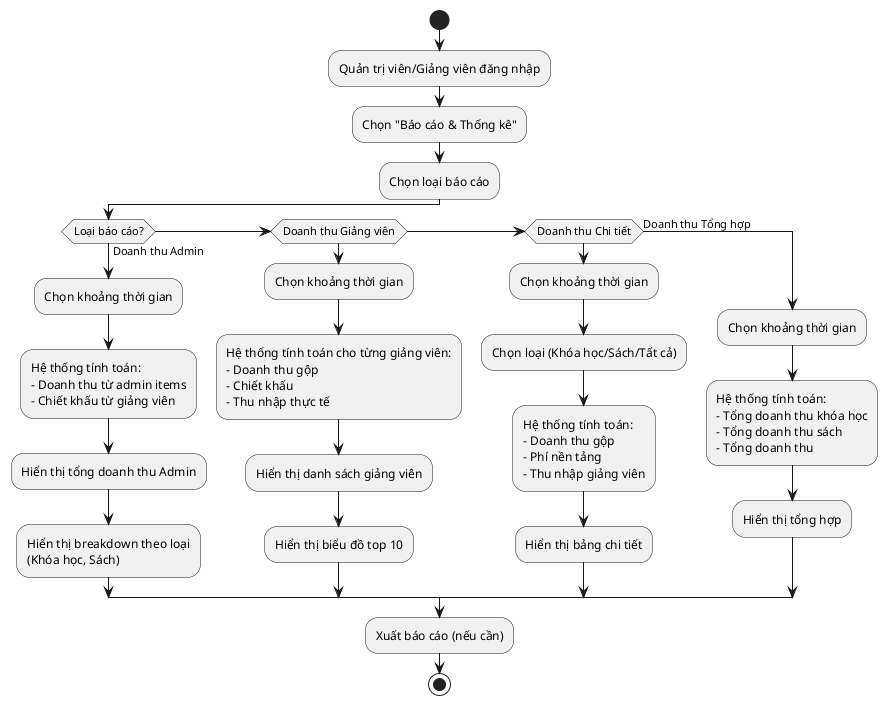

### Hình 2.18: Sơ đồ tuần tự quy trình xem báo cáo doanh thu

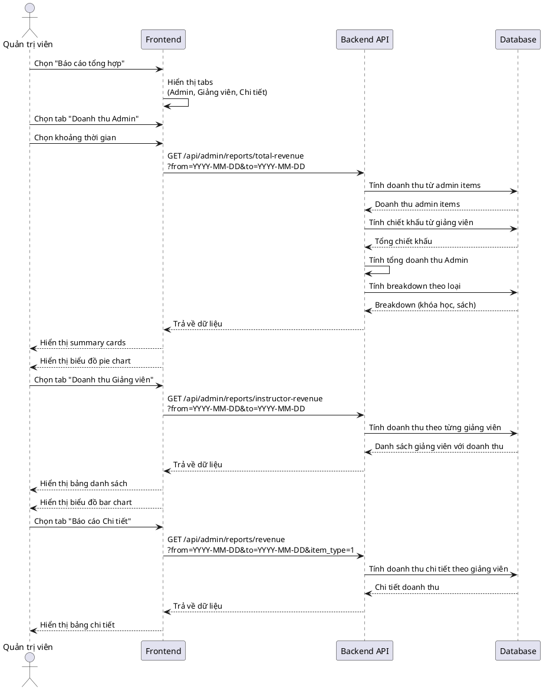
