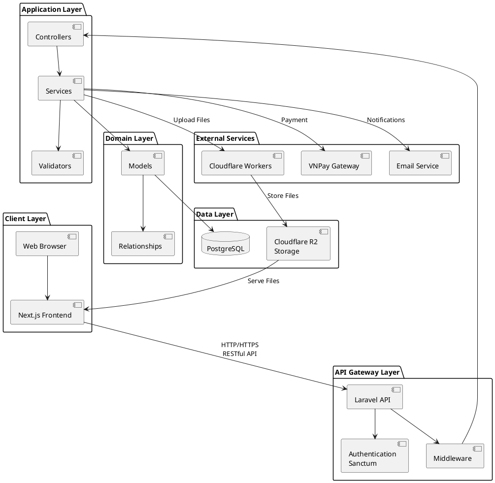
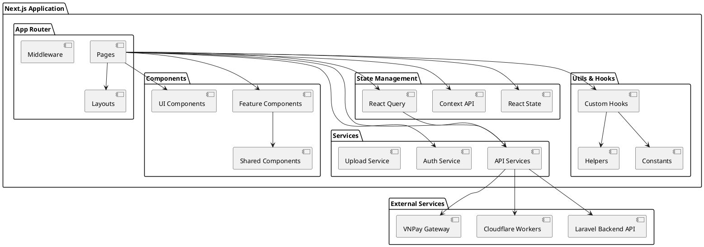
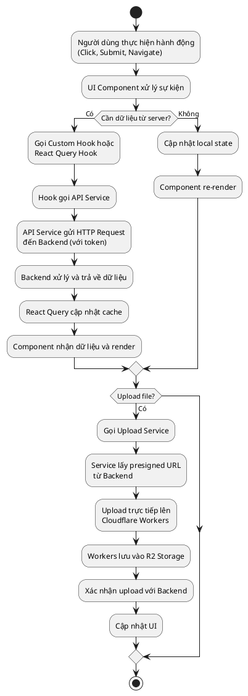
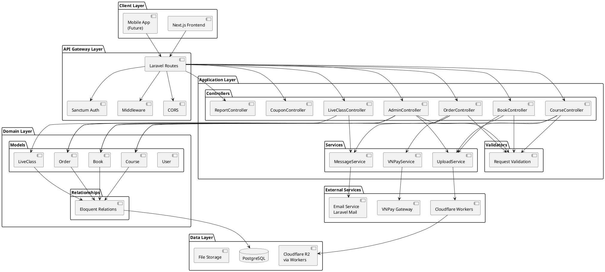
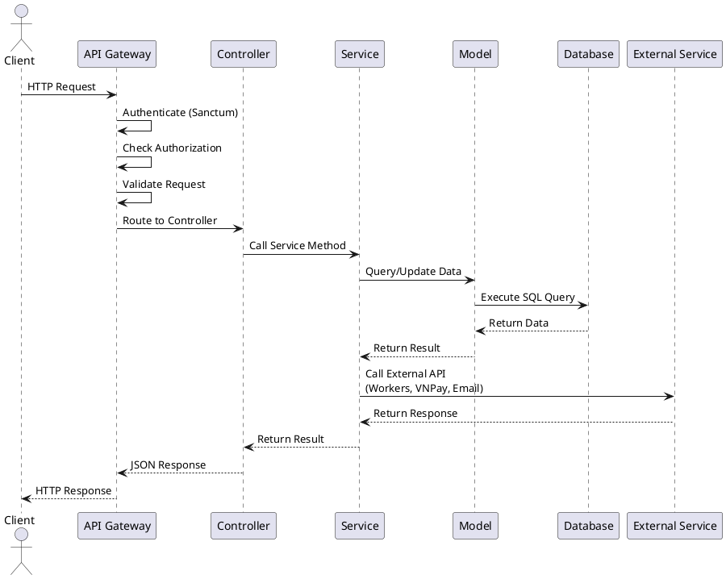

# CHƯƠNG 1: GIỚI THIỆU CHUNG VỀ HỆ THỐNG

## 1.1. Tóm tắt hệ thống

Hệ thống Khởi Trí Số (Digital Learning Platform) là một nền tảng giáo dục trực tuyến toàn diện, được thiết kế để quản lý và phân phối các khóa học trực tuyến và sách điện tử một cách hiệu quả. Hệ thống tích hợp giao diện người dùng hiện đại (Frontend) và hệ thống xử lý nghiệp vụ mạnh mẽ (Backend), sử dụng công nghệ tiên tiến như Laravel 12+ (PHP 8.2+), Next.js 15+ (React), PostgreSQL, và Cloudflare Workers để cung cấp một nền tảng học tập linh hoạt, bảo mật và có khả năng mở rộng cao. Hệ thống hỗ trợ các chức năng cốt lõi như quản lý khóa học, bài giảng video, tài liệu học tập, hệ thống câu hỏi và đánh giá, quản lý người dùng với phân quyền đa cấp, thanh toán trực tuyến qua VNPay, và phân tích doanh thu chi tiết, giúp tối ưu hóa trải nghiệm học tập cho học viên và quản lý hiệu quả cho giảng viên và quản trị viên.

Đặc biệt, Khởi Trí Số được phát triển để đáp ứng nhu cầu chuyển đổi số trong giáo dục tại Việt Nam, nơi việc học tập trực tuyến ngày càng trở nên phổ biến. Với khả năng tích hợp Cloudflare Workers cho việc upload và lưu trữ file (hình ảnh, video, tài liệu) trên R2 storage, hệ thống thanh toán VNPay, thông báo real-time qua email và in-app notifications, lớp học trực tuyến (live classes), và hệ thống phân quyền chặt chẽ (Admin, Instructor, Student), Khởi Trí Số không chỉ mang lại sự tiện lợi mà còn đảm bảo tính linh hoạt, hiệu năng cao và khả năng mở rộng để phù hợp với xu hướng giáo dục số hiện đại.

## 1.2. Mục tiêu và phạm vi dự án

### 1.2.1. Mục tiêu dự án

Dự án Khởi Trí Số được xây dựng nhằm đáp ứng nhu cầu chuyển đổi số trong giáo dục, với trọng tâm là tối ưu hóa quy trình quản lý khóa học và nâng cao trải nghiệm học tập. Các mục tiêu chính bao gồm:

- **Tự động hóa quy trình quản lý giáo dục**: Chuyển đổi các thao tác thủ công như quản lý khóa học, bài giảng, tài liệu, câu hỏi và đánh giá sang nền tảng số, giúp giảm thiểu sai sót, tiết kiệm thời gian và tăng hiệu quả làm việc cho giảng viên và quản trị viên.

- **Nâng cao trải nghiệm học tập**: Cung cấp giao diện trực quan, dễ sử dụng cho học viên (xem khóa học, học video, làm bài tập, xem sách điện tử) và giảng viên (tạo khóa học, quản lý bài giảng, chấm bài), từ đó cải thiện chất lượng giáo dục và sự hài lòng của người học.

- **Hỗ trợ ra quyết định kinh doanh**: Tích hợp các công cụ phân tích dữ liệu và báo cáo doanh thu chi tiết (theo khóa học, sách, giảng viên, tổng hợp), thống kê người dùng đã đăng ký, phân tích hiệu suất khóa học, giúp quản trị viên đưa ra các chiến lược kinh doanh phù hợp và kịp thời.

- **Đảm bảo bảo mật và phân quyền**: Triển khai mô hình phân quyền dựa trên vai trò (RBAC) với 3 cấp độ chính (Admin, Instructor, Student) và các cơ chế bảo mật như Laravel Sanctum, JWT, nhằm bảo vệ dữ liệu nhạy cảm, nội dung khóa học có bản quyền và hạn chế truy cập trái phép.

- **Khả năng mở rộng và tích hợp**: Thiết kế hệ thống linh hoạt, cho phép tích hợp với các dịch vụ bên thứ ba như Cloudflare Workers (upload file), VNPay (thanh toán), và hỗ trợ mở rộng trong tương lai, chẳng hạn như tích hợp AI cho gợi ý khóa học, chatbot hỗ trợ học viên, hoặc hệ thống chứng chỉ số.

### 1.2.2. Phạm vi dự án

Dự án Khởi Trí Số tập trung vào việc phát triển một nền tảng giáo dục trực tuyến toàn diện, bao quát các hoạt động quản lý và học tập chính, với các chức năng cụ thể sau:

- **Quản lý người dùng**: Hỗ trợ đăng ký, đăng nhập, xác minh tài khoản qua email hoặc OAuth. Quản trị viên có thể quản lý hồ sơ người dùng, phân quyền, và gán vai trò (Admin, Instructor, Student). Hệ thống hỗ trợ quản lý giảng viên, học viên, và theo dõi hoạt động đăng nhập.

- **Quản lý khóa học**: Cho phép giảng viên và admin tạo, chỉnh sửa, và xóa khóa học với đầy đủ thông tin (mô tả, yêu cầu, nội dung học, giá, danh mục). Hệ thống hỗ trợ phê duyệt khóa học, xuất bản, và quản lý trạng thái (active/inactive, published/unpublished).

- **Quản lý bài giảng và tài liệu**: Cung cấp khả năng tạo bài giảng video với thông tin chi tiết (tiêu đề, mô tả, nội dung rich text, video URL, thời lượng), đính kèm tài liệu học tập (PDF, Word, Excel, PowerPoint, ZIP, hình ảnh, video, audio) thông qua Cloudflare Workers để upload và lưu trữ trên R2 storage. Hệ thống hỗ trợ sắp xếp bài giảng theo thứ tự và tự động đánh dấu bài đầu tiên là miễn phí.

- **Quản lý câu hỏi và đánh giá**: Cho phép tạo câu hỏi cho từng bài học (trắc nghiệm, tự luận) với đáp án, lời giải (LaTeX, video, file), và điểm số. Hệ thống hỗ trợ tạo bài tập (assignments) với nhiều câu hỏi, chấm điểm tự động và thủ công, theo dõi kết quả học tập của học viên.

- **Quản lý sách điện tử**: Cung cấp khả năng tạo và quản lý sách điện tử với thông tin đầy đủ (ISBN tự động, tiêu đề, mô tả, giá, danh mục, tác giả). Hệ thống hỗ trợ tạo chương sách với nội dung rich text (hỗ trợ LaTeX cho công thức toán học), câu hỏi cho từng chương, và mã kích hoạt sách.

- **Quản lý đơn hàng và thanh toán**: Tự động hóa quy trình từ thêm vào giỏ hàng, tạo đơn hàng, thanh toán trực tuyến qua VNPay, và xử lý đơn hàng (kích hoạt khóa học/sách cho học viên). Hệ thống hỗ trợ áp dụng mã giảm giá (coupon) với hai loại: giảm giá phần trăm (%) và giảm giá cố định (VNĐ).

- **Quản lý lớp học trực tuyến (Live Classes)**: Cho phép giảng viên tạo và quản lý lớp học trực tuyến với thông tin chi tiết (tiêu đề, mô tả, khóa học liên kết, thời gian lên lịch, URL phòng họp, mật khẩu, số lượng người tham gia tối đa). Hệ thống tự động gửi thông báo và email cho học viên đã đăng ký khi lớp học được lên lịch và khi sắp bắt đầu.

- **Quản lý báo cáo và thống kê**: Cung cấp báo cáo doanh thu chi tiết (theo khóa học, sách, giảng viên, tổng hợp), thống kê người dùng đã đăng ký, phân tích hiệu suất khóa học (số lượng đăng ký, tiến độ học tập, mức độ tương tác), và tính toán chiết khấu tự động cho giảng viên (30% cho hệ thống).

- **Quản lý nội dung và SEO**: Hỗ trợ quản lý danh mục (categories) với cấu trúc phân cấp, tạo trang tĩnh (static pages) với SEO tối ưu (metadata, Open Graph, Twitter Cards, JSON-LD structured data, sitemap, robots.txt), và quản lý cài đặt hệ thống (logo, banner, hotline, tỷ lệ chiết khấu).

- **Bảo mật và tích hợp**: Áp dụng mô hình RBAC với 3 vai trò chính, tích hợp Cloudflare Workers cho việc upload và lưu trữ file với JWT authentication, tích hợp VNPay cho thanh toán, thông báo qua email và in-app notifications, và cung cấp API RESTful đầy đủ để hỗ trợ tích hợp với các hệ thống bên ngoài.

Về công nghệ, hệ thống sử dụng Laravel 12+ (PHP 8.2+) cho backend, PostgreSQL cho cơ sở dữ liệu, Next.js 15+ với React và Tailwind CSS cho frontend, Cloudflare Workers cho việc xử lý upload file và lưu trữ trên R2 storage. Quá trình phát triển được hỗ trợ bởi các công cụ như Composer, Artisan, PHPUnit, Vite, và TypeScript, triển khai trên môi trường máy chủ Nginx hoặc Apache, đảm bảo hiệu năng cao, tính ổn định và khả năng mở rộng.

### 1.2.3. Công nghệ và kiến trúc hệ thống

Hệ thống Khởi Trí Số được xây dựng dựa trên kiến trúc client-server hiện đại với các thành phần chính:

- **Backend (Laravel 12+)**: Xử lý logic nghiệp vụ, quản lý cơ sở dữ liệu, xác thực và phân quyền người dùng, cung cấp API RESTful cho frontend. Sử dụng Laravel Sanctum cho authentication, Eloquent ORM cho truy vấn database, và các middleware để bảo mật.

- **Frontend (Next.js 15+)**: Giao diện người dùng được xây dựng với React và Next.js, hỗ trợ Server-Side Rendering (SSR) và Static Site Generation (SSG) cho SEO tối ưu. Sử dụng Tailwind CSS cho styling, React Query cho quản lý state và caching, và các thư viện như Tiptap cho rich text editor, Recharts cho biểu đồ.

- **Database (PostgreSQL)**: Lưu trữ dữ liệu với khả năng hỗ trợ JSON fields, full-text search, và transactions phức tạp. Hệ thống sử dụng migrations để quản lý schema và seeders để tạo dữ liệu mẫu.

- **Cloudflare Workers**: Xử lý việc upload và lưu trữ file (hình ảnh, video, tài liệu) trên Cloudflare R2 storage với JWT authentication. Worker đảm bảo tính bảo mật, hiệu năng cao và khả năng mở rộng cho việc lưu trữ file.

- **Payment Gateway (VNPay)**: Tích hợp thanh toán trực tuyến an toàn, hỗ trợ các phương thức thanh toán phổ biến tại Việt Nam, với callback verification và xử lý đơn hàng tự động.

- **Email & Notifications**: Hệ thống gửi email thông qua Laravel Mail với các template Blade, và quản lý thông báo in-app thông qua bảng notifications trong database.

Hệ thống được thiết kế với nguyên tắc separation of concerns, modularity, và scalability, đảm bảo dễ dàng bảo trì, mở rộng và tích hợp các tính năng mới trong tương lai.

## 2.2. Yêu cầu hệ thống

Nhóm phát triển đã tiến hành khảo sát các chức năng của nhiều nền tảng giáo dục trực tuyến hiện có, đồng thời thực hiện phân tích bổ sung nhằm hoàn thiện mô hình nghiệp vụ đề xuất. Từ đó, hệ thống Khởi Trí Số được xây dựng với mục tiêu tự động hóa quy trình quản lý giáo dục, nâng cao hiệu quả dạy và học, và cải thiện trải nghiệm người dùng. Hệ thống được thiết kế để đáp ứng nhu cầu của ba nhóm người dùng chính:

- **Học viên (Student)**: Sử dụng giao diện web để xem khóa học, học video bài giảng, làm bài tập, đọc sách điện tử, tham gia lớp học trực tuyến, thanh toán và nhận chứng chỉ.

- **Giảng viên (Instructor)**: Thực hiện các tác vụ quản lý khóa học như tạo khóa học, upload bài giảng video, tạo tài liệu học tập, tạo câu hỏi và bài tập, chấm điểm, quản lý lớp học trực tuyến, và xem báo cáo doanh thu.

- **Quản trị viên (Admin)**: Giám sát toàn bộ hoạt động, quản lý người dùng, phê duyệt khóa học và sách, quản lý danh mục, hệ thống mã giảm giá, báo cáo doanh thu tổng hợp và các báo cáo phân tích chi tiết.

Hệ thống được xây dựng với mục tiêu hỗ trợ toàn bộ quá trình giáo dục trực tuyến, từ khâu tạo khóa học, phê duyệt nội dung, đăng ký và thanh toán, đến học tập, đánh giá và cấp chứng chỉ. Tất cả các chức năng được thiết kế nhằm đảm bảo sự thuận tiện, chính xác và đồng bộ dữ liệu giữa các nhóm người dùng.

### 2.2.1. Yêu cầu chức năng

#### 2.2.1.1. Quản lý khóa học và bài giảng

Hệ thống cần được xây dựng nhằm hỗ trợ giảng viên và quản trị viên trong toàn bộ quá trình tạo, quản lý và phân phối khóa học trực tuyến, đảm bảo nội dung chất lượng, dễ tiếp cận và có tính tương tác cao. Trước hết, hệ thống phải cung cấp giao diện tạo khóa học trực quan, cho phép giảng viên nhập đầy đủ thông tin như tiêu đề, mô tả (với rich text editor), yêu cầu tiên quyết, nội dung học tập, giá bán, danh mục, và hình ảnh đại diện. Hệ thống cần hỗ trợ upload hình ảnh và video thông qua Cloudflare Workers để lưu trữ trên R2 storage, đảm bảo hiệu năng cao và khả năng mở rộng.

Tiếp theo, hệ thống cần cho phép giảng viên tạo và quản lý bài giảng (lessons) cho từng khóa học, với khả năng sắp xếp theo thứ tự logic. Mỗi bài giảng phải bao gồm thông tin chi tiết như tiêu đề, mô tả, nội dung rich text (hỗ trợ định dạng như Google Docs), video bài giảng (với tự động trích xuất thời lượng), và các tài liệu đính kèm (PDF, Word, Excel, PowerPoint, ZIP, hình ảnh, video, audio). Hệ thống phải tự động đánh dấu bài giảng đầu tiên (order = 0) là miễn phí để học viên có thể xem thử trước khi quyết định mua khóa học.

Để đảm bảo chất lượng nội dung, hệ thống cần hỗ trợ quy trình phê duyệt khóa học, cho phép quản trị viên xem xét, phê duyệt hoặc từ chối khóa học với lý do cụ thể. Sau khi được phê duyệt, giảng viên có thể xuất bản khóa học để học viên có thể đăng ký và học tập. Quá trình này phải đảm bảo tính toàn vẹn dữ liệu (ACID), giúp việc cập nhật và xử lý thông tin diễn ra chính xác, nhất quán giữa các người dùng truy cập cùng lúc.

Bên cạnh đó, hệ thống phải hỗ trợ quản lý tài liệu học tập một cách linh hoạt, cho phép giảng viên upload nhiều loại file khác nhau và tự động phân loại theo định dạng. Tất cả các file được upload phải được xử lý qua Cloudflare Workers với JWT authentication để đảm bảo bảo mật, và lưu trữ trên R2 storage với khả năng truy cập nhanh chóng. Hệ thống cần tự động tạo URL công khai hoặc riêng tư tùy theo loại tài liệu, đảm bảo học viên chỉ có thể truy cập tài liệu của khóa học mà họ đã đăng ký.

Cuối cùng, để nâng cao trải nghiệm học tập, hệ thống cần hỗ trợ theo dõi tiến độ học tập của học viên, bao gồm thời gian học, số bài đã hoàn thành, và điểm số đạt được. Dữ liệu này giúp giảng viên đánh giá hiệu quả khóa học và hỗ trợ học viên trong quá trình học tập.

#### 2.2.1.2. Quản lý sách điện tử

Hệ thống cần đảm bảo khả năng quản lý toàn bộ quá trình tạo, xuất bản và phân phối sách điện tử một cách hiệu quả, minh bạch và thuận tiện cho cả tác giả lẫn độc giả. Quản trị viên và tác giả có thể tạo sách điện tử với thông tin đầy đủ như tiêu đề, mô tả (với rich text editor), ISBN (tự động tạo unique), giá bán, danh mục, hình ảnh bìa, và thông tin tác giả. Giao diện tạo sách cần phải đảm bảo cập nhật thông tin chính xác và hỗ trợ preview trước khi xuất bản.

Sau khi tạo sách, hệ thống phải cho phép tạo và quản lý các chương sách (chapters) với nội dung rich text, hỗ trợ định dạng như Google Docs và hiển thị công thức toán học bằng LaTeX (với KaTeX renderer). Mỗi chương có thể chứa nhiều câu hỏi (questions) với các loại khác nhau như trắc nghiệm và tự luận. Câu hỏi phải bao gồm đáp án, lời giải (có thể là text LaTeX, video, hoặc file), điểm số, và mức độ khó. Hệ thống cần hỗ trợ tạo câu hỏi mẫu để giảng viên có thể chèn nhanh vào chương sách.

Khi thanh toán, hệ thống cần hỗ trợ nhiều hình thức linh hoạt, bao gồm thanh toán online qua VNPay và thanh toán bằng mã kích hoạt (activation code). Trong trường hợp học viên mua sách qua đơn hàng, hệ thống phải tự động tạo và gán mã kích hoạt cho học viên, đảm bảo tính chính xác và minh bạch. Đồng thời, hệ thống cần cung cấp chức năng quản lý mã kích hoạt, cho phép quản trị viên tạo hàng loạt mã kích hoạt cho một cuốn sách, theo dõi trạng thái sử dụng, và xuất báo cáo.

Ngoài ra, hệ thống phải có khả năng tự động áp dụng các mã giảm giá (coupon) hợp lệ khi học viên thanh toán, hỗ trợ cả giảm giá phần trăm (%) và giảm giá cố định (VNĐ), nhằm khuyến khích học viên mua sách và nâng cao tính chuyên nghiệp trong dịch vụ.

#### 2.2.1.3. Quản lý đơn hàng và thanh toán

Hệ thống cần cung cấp các chức năng hỗ trợ học viên và quản trị viên trong quá trình quản lý và xử lý đơn hàng một cách linh hoạt và hiệu quả. Trước hết, hệ thống phải cho phép học viên thêm khóa học và sách điện tử vào giỏ hàng, xem tổng giá trị, áp dụng mã giảm giá, và tạo đơn hàng. Giao diện giỏ hàng cần phải đảm bảo cập nhật giá và trạng thái sản phẩm chính xác, hiển thị thông tin chi tiết về từng sản phẩm (hình ảnh, tên, giá, giảng viên/tác giả).

Ngoài ra, hệ thống cần hỗ trợ thanh toán trực tuyến qua VNPay, một cổng thanh toán phổ biến tại Việt Nam. Quá trình thanh toán phải đảm bảo tính bảo mật cao, với việc xác thực callback từ VNPay và tự động cập nhật trạng thái đơn hàng sau khi thanh toán thành công. Khi đơn hàng được thanh toán, hệ thống phải tự động kích hoạt khóa học hoặc sách điện tử cho học viên, gửi thông báo xác nhận qua email và in-app notification, và cập nhật số lượng đăng ký/mua của sản phẩm.

Đối với quy trình xử lý đơn hàng, hệ thống phải cho phép quản trị viên xem danh sách tất cả đơn hàng, lọc theo trạng thái (chờ thanh toán, đã thanh toán, đã hủy), xem chi tiết đơn hàng (thông tin khách hàng, sản phẩm, giá trị, phương thức thanh toán), và theo dõi lịch sử giao dịch. Tính năng này không chỉ giúp đồng bộ hoạt động giữa các bộ phận mà còn giảm thiểu tình trạng sai sót hoặc nhầm lẫn trong quá trình xử lý đơn hàng.

Bên cạnh đó, hệ thống cần hỗ trợ tính toán và lưu trữ chiết khấu tự động cho giảng viên khi bán khóa học hoặc sách của họ. Hệ thống phải tự động tính toán 30% cho hệ thống (platform fee) và 70% cho giảng viên (instructor revenue), lưu trữ thông tin này trong mỗi order item để hỗ trợ báo cáo doanh thu chi tiết. Cuối cùng, để đảm bảo tính chính xác trong quản lý tài chính, hệ thống phải có cơ chế tự động cập nhật trạng thái đơn hàng, gửi thông báo cho các bên liên quan, và tạo báo cáo doanh thu theo thời gian thực.

#### 2.2.1.4. Quản lý câu hỏi và đánh giá

Để hỗ trợ giảng viên và quản trị viên trong việc tạo, quản lý và chấm điểm các câu hỏi, bài tập và đánh giá học tập một cách hiệu quả, chính xác và có tính tương tác cao. Trước hết, hệ thống phải cung cấp các chức năng tạo câu hỏi cho từng bài học hoặc chương sách, hỗ trợ nhiều loại câu hỏi khác nhau như trắc nghiệm (multiple choice) và tự luận (essay). Mỗi câu hỏi phải bao gồm thông tin chi tiết như nội dung câu hỏi, đáp án (với nhiều lựa chọn cho trắc nghiệm), lời giải (có thể là text LaTeX, video, hoặc file), điểm số, và mức độ khó. Hệ thống cần hỗ trợ tạo câu hỏi mẫu để giảng viên có thể chèn nhanh vào bài học hoặc chương sách.

Đồng thời, hệ thống cần hỗ trợ tạo bài tập (assignments) cho từng bài học, với khả năng bao gồm nhiều câu hỏi khác nhau. Mỗi bài tập phải có thông tin về thời hạn nộp bài, số lần được phép làm lại, và cách tính điểm (tự động cho trắc nghiệm, thủ công cho tự luận). Hệ thống phải tự động chấm điểm các câu hỏi trắc nghiệm và lưu kết quả, đồng thời cho phép giảng viên chấm điểm thủ công các câu hỏi tự luận với khả năng thêm nhận xét.

Bên cạnh đó, hệ thống phải có khả năng theo dõi và quản lý các lần làm bài của học viên, bao gồm thời gian bắt đầu, thời gian nộp bài, điểm số đạt được, và các câu trả lời chi tiết. Dữ liệu này giúp giảng viên đánh giá tiến độ học tập của học viên, phát hiện các vấn đề trong quá trình học, và đưa ra các biện pháp hỗ trợ phù hợp. Hệ thống cũng cần hỗ trợ tạo báo cáo thống kê về kết quả học tập, bao gồm điểm trung bình, tỷ lệ hoàn thành, và phân tích các câu hỏi khó.

Về phía công tác đánh giá, hệ thống cần cung cấp các công cụ để học viên xem lại bài làm của mình, bao gồm đáp án đúng, lời giải chi tiết (với hỗ trợ hiển thị công thức toán học bằng LaTeX), và nhận xét từ giảng viên. Từ đó, học viên có thể học hỏi từ những sai sót và cải thiện kết quả học tập trong các lần làm bài tiếp theo.

Cuối cùng, hệ thống phải có khả năng tổng hợp và theo dõi toàn bộ dữ liệu về câu hỏi, bài tập và kết quả học tập theo thời gian, giúp giảng viên và quản trị viên có cái nhìn tổng quan về chất lượng khóa học và đưa ra các quyết định cải thiện nội dung hợp lý. Các báo cáo thống kê và biểu đồ trực quan cần được tích hợp nhằm hỗ trợ phân tích xu hướng học tập, đánh giá hiệu quả giảng dạy và hoạch định chiến lược giáo dục trong tương lai.

#### 2.2.1.5. Quản lý lớp học trực tuyến (Live Classes)

Hệ thống cần đảm bảo tính linh hoạt cao trong việc quản lý và tổ chức lớp học trực tuyến, bao gồm lên lịch, thông báo, và theo dõi tham gia của học viên. Trước hết, hệ thống phải cho phép giảng viên tạo lớp học trực tuyến với thông tin đầy đủ như tiêu đề, mô tả, khóa học liên kết, thời gian lên lịch, URL phòng họp (ví dụ: Google Meet, Zoom), ID và mật khẩu phòng họp, số lượng người tham gia tối đa, và các tùy chọn như bật/tắt chat, ghi lại buổi học. Việc này giúp đảm bảo lớp học được tổ chức một cách chuyên nghiệp và có hệ thống.

Ngoài ra, hệ thống cần hỗ trợ tự động gửi thông báo và email cho tất cả học viên đã đăng ký khóa học khi lớp học được lên lịch, bao gồm thông tin về thời gian, link tham gia, và hướng dẫn. Hệ thống cũng phải tự động gửi thông báo nhắc nhở khi lớp học sắp bắt đầu (ví dụ: 15 phút trước), giúp học viên không bỏ lỡ buổi học. Tất cả các thông báo phải được lưu trữ trong hệ thống để học viên có thể xem lại trong phần thông báo (notification bell).

Bên cạnh quản lý lịch học, hệ thống cũng cần cung cấp công cụ để giảng viên và quản trị viên theo dõi trạng thái lớp học (sắp diễn ra, đang diễn ra, đã kết thúc), số lượng người tham gia, và link ghi lại buổi học (nếu có). Chức năng này phải cho phép quản lý điều chỉnh lịch học, hủy lớp học, và cập nhật thông tin phòng họp khi cần thiết.

Để hỗ trợ công tác quản lý và ra quyết định, hệ thống cần tích hợp các chức năng theo dõi và đánh giá hiệu quả lớp học trực tuyến, bao gồm số lượng học viên tham gia, tỷ lệ tham gia so với số lượng đăng ký, và phản hồi từ học viên. Dữ liệu thu thập sẽ được tổng hợp thành các báo cáo thống kê chi tiết, cho phép quản lý dễ dàng phân tích hiệu quả của các lớp học trực tuyến và đưa ra các cải thiện phù hợp.

#### 2.2.1.6. Quản lý báo cáo và thống kê

Hệ thống cần cung cấp công cụ quản lý toàn diện cho quản trị viên và giảng viên, nhằm hỗ trợ giám sát, phân tích và điều hành hoạt động kinh doanh một cách hiệu quả, minh bạch và có tính hệ thống. Trung tâm của mô-đun này là bảng điều khiển tổng quan (Dashboard), hiển thị các chỉ số hoạt động chính như doanh thu theo ngày/tháng, số lượng đơn hàng, số lượng khóa học và sách, số lượng học viên đăng ký, hiệu suất khóa học và các chỉ báo vận hành khác. Thông qua đó, quản lý có thể nhanh chóng đánh giá tình hình kinh doanh và đưa ra quyết định điều chỉnh kịp thời.

Bên cạnh đó, hệ thống cần hỗ trợ chức năng báo cáo doanh thu chi tiết, bao gồm:

- **Báo cáo doanh thu Admin**: Tổng hợp doanh thu từ các khóa học và sách do admin tạo, cộng với chiết khấu (30%) từ các khóa học và sách do giảng viên tạo.

- **Báo cáo doanh thu Giảng viên**: Hiển thị doanh thu của từng giảng viên, bao gồm doanh thu gộp, chiết khấu, và thu nhập thực tế.

- **Báo cáo doanh thu Chi tiết**: Phân tích doanh thu theo từng giảng viên/tác giả, với breakdown về phí nền tảng và thu nhập giảng viên.

- **Báo cáo doanh thu Tổng hợp**: Tổng hợp doanh thu từ cả khóa học và sách điện tử trong một khoảng thời gian.

Hệ thống cũng cần hỗ trợ thống kê người dùng đã đăng ký, bao gồm số lượng học viên đăng ký từng khóa học, tiến độ học tập, mức độ tương tác, và phân tích hiệu suất khóa học. Các báo cáo này phải được hiển thị dưới dạng biểu đồ trực quan (line chart, bar chart, pie chart) để dễ dàng phân tích và đưa ra quyết định.

Về mặt an toàn hệ thống, cần đảm bảo cơ chế bảo mật và phân quyền truy cập chi tiết, giúp ngăn chặn truy cập trái phép và bảo vệ dữ liệu nội bộ. Hệ thống phải hỗ trợ xác thực người dùng theo vai trò (Admin, Instructor, Student), đồng thời cho phép phân quyền chi tiết đến từng nhóm chức năng hoặc module, đảm bảo mỗi người dùng chỉ được phép thực hiện các thao tác trong phạm vi quyền hạn của mình.

### 2.2.2. Yêu cầu phi chức năng

- **Hiệu năng**: Hệ thống phải đáp ứng số lượng người dùng truy cập đồng thời cao, đặc biệt trong các giờ cao điểm khi nhiều học viên cùng xem video bài giảng hoặc tham gia lớp học trực tuyến. Hệ thống sử dụng Cloudflare Workers và R2 storage để đảm bảo tốc độ tải nhanh cho các file media.

- **Tính nhất quán (Consistency)**: Dữ liệu phải đảm bảo ACID, đặc biệt trong quy trình đặt hàng, thanh toán và kích hoạt khóa học/sách. Hệ thống sử dụng PostgreSQL với transaction để đảm bảo tính toàn vẹn dữ liệu.

- **Tính sẵn sàng**: Hệ thống hoạt động 24/7, có cơ chế sao lưu và khôi phục dữ liệu định kỳ. Hệ thống sử dụng Cloudflare R2 storage với khả năng sao lưu tự động và CDN toàn cầu.

- **Bảo mật**: Bảo vệ thông tin người dùng, dữ liệu thanh toán và nội dung khóa học có bản quyền. Hệ thống sử dụng Laravel Sanctum cho authentication, JWT cho Cloudflare Workers, và mã hóa dữ liệu nhạy cảm.

- **Khả năng mở rộng**: Cho phép mở rộng thêm tính năng hoặc tích hợp với các dịch vụ bên thứ ba (ví dụ: hệ thống chứng chỉ số, AI cho gợi ý khóa học, chatbot hỗ trợ học viên). Kiến trúc microservices với API RESTful cho phép tích hợp dễ dàng.

- **Khả năng sử dụng (Usability)**: Giao diện người dùng phải trực quan, dễ sử dụng, hỗ trợ đa ngôn ngữ (tiếng Việt, tiếng Anh), và responsive trên nhiều thiết bị (desktop, tablet, mobile).

- **Khả năng bảo trì (Maintainability)**: Code được tổ chức theo mô hình MVC, có documentation đầy đủ, và tuân thủ các coding standards để dễ dàng bảo trì và mở rộng.

## 2.3. Phân tích yêu cầu

*Xem chi tiết các biểu đồ UML trong file [BIEU_DO_UML.md](./BIEU_DO_UML.md)*

Các biểu đồ UML bao gồm:

### 2.3.1. Quản lý khóa học và bài giảng

- **Hình 2.1**: Sơ đồ Use case quản lý khóa học và bài giảng
- **Hình 2.2**: Sơ đồ hoạt động quy trình tạo và phê duyệt khóa học
- **Hình 2.3**: Sơ đồ tuần tự các bước trong quy trình học viên xem khóa học

### 2.3.2. Quản lý sách điện tử

- **Hình 2.4**: Sơ đồ Use case quản lý sách điện tử
- **Hình 2.5**: Sơ đồ hoạt động quy trình tạo và đọc sách điện tử
- **Hình 2.6**: Sơ đồ tuần tự quy trình học viên mua và kích hoạt sách

### 2.3.3. Quản lý đơn hàng và thanh toán

- **Hình 2.7**: Sơ đồ Use case quản lý đơn hàng và thanh toán
- **Hình 2.8**: Sơ đồ hoạt động quy trình đặt hàng và thanh toán
- **Hình 2.9**: Sơ đồ tuần tự quy trình thanh toán qua VNPay

### 2.3.4. Quản lý câu hỏi và đánh giá

- **Hình 2.10**: Sơ đồ Use case quản lý câu hỏi và đánh giá
- **Hình 2.11**: Sơ đồ hoạt động quy trình làm bài tập và chấm điểm
- **Hình 2.12**: Sơ đồ tuần tự quy trình học viên làm bài tập

### 2.3.5. Quản lý lớp học trực tuyến

- **Hình 2.13**: Sơ đồ Use case quản lý lớp học trực tuyến
- **Hình 2.14**: Sơ đồ hoạt động quy trình tạo và tham gia lớp học trực tuyến
- **Hình 2.15**: Sơ đồ tuần tự quy trình tạo và gửi thông báo lớp học

### 2.3.6. Quản lý báo cáo và thống kê

- **Hình 2.16**: Sơ đồ Use case quản lý báo cáo và thống kê
- **Hình 2.17**: Sơ đồ hoạt động quy trình xem báo cáo doanh thu
- **Hình 2.18**: Sơ đồ tuần tự quy trình xem báo cáo doanh thu

## CHƯƠNG 3: XÂY DỰNG VÀ PHÁT TRIỂN HỆ THỐNG

### 3.1. Kiến trúc hệ thống

#### Hình 3.1: Kiến trúc hệ thống

Để đáp ứng yêu cầu của hệ thống, nhóm phát triển xây dựng kiến trúc theo mô hình Client-Server, với sự phân tách rõ ràng giữa giao diện người dùng (frontend) và phần xử lý logic nghiệp vụ cùng quản lý dữ liệu (backend). Frontend được phát triển bằng Next.js 15+ kết hợp React và TypeScript, chịu trách nhiệm hiển thị giao diện, quản lý trải nghiệm người dùng và tương tác với server thông qua các API. Next.js hỗ trợ Server-Side Rendering (SSR) và Static Site Generation (SSG) cho SEO tối ưu, đồng thời cung cấp các tính năng như routing tự động, code splitting, và image optimization, từ đó nâng cao hiệu năng và trải nghiệm người dùng. Các thành phần giao diện được tổ chức dưới dạng component có thể tái sử dụng, trong khi trạng thái dữ liệu được quản lý thông qua React state, Context API, và các thư viện quản lý state, đảm bảo tính nhất quán và dễ mở rộng.

Phần Backend được phát triển bằng Laravel 12+ chạy trên PHP 8.2+, cung cấp các API cho frontend thông qua mô hình RESTful. Laravel đảm nhận việc xử lý toàn bộ logic nghiệp vụ, bao gồm validation dữ liệu, kiểm tra quyền truy cập, và quản lý các thao tác trên cơ sở dữ liệu. Đặc biệt, hệ thống sử dụng Laravel Sanctum để quản lý xác thực và phân quyền, hỗ trợ SPA authentication an toàn và hiệu quả. Các truy vấn dữ liệu được thực hiện thông qua Eloquent ORM và raw SQL queries (cho PostgreSQL), giúp code server trực quan, dễ bảo trì và giảm thiểu lỗi khi tương tác với cơ sở dữ liệu. Công cụ Laravel Artisan được sử dụng trong quá trình phát triển và kiểm thử, giúp nhanh chóng tạo migrations, seeders, và kiểm tra các truy vấn.

Cơ sở dữ liệu của hệ thống sử dụng PostgreSQL, một hệ quản trị cơ sở dữ liệu quan hệ mạnh mẽ với khả năng hỗ trợ JSON fields, full-text search, và transactions phức tạp. Dữ liệu được tổ chức thành các bảng quan hệ với các ràng buộc về khóa chính, khóa ngoại và chỉ mục, nhằm tối ưu hóa hiệu suất truy vấn và bảo toàn tính toàn vẹn dữ liệu. Backend thông qua Eloquent ORM và raw SQL sẽ thực hiện các truy vấn một cách trực quan và an toàn, đồng thời dễ dàng mở rộng khi hệ thống phát triển.

Hệ thống tích hợp Cloudflare Workers để xử lý việc upload và lưu trữ file (hình ảnh, video, tài liệu) trên Cloudflare R2 storage. Workers đảm bảo tính bảo mật thông qua JWT authentication, hiệu năng cao với CDN toàn cầu, và khả năng mở rộng cho việc lưu trữ file. Tất cả các file được upload đều được xử lý qua Workers với khả năng tạo presigned URLs, xác thực signature, và lưu trữ an toàn trên R2.

Luồng dữ liệu trong hệ thống tuân thủ mô hình client-server. Khi người dùng thực hiện các hành động trên giao diện, frontend sẽ gửi request HTTP đến backend. Server kiểm tra và xác thực yêu cầu qua Sanctum, xử lý logic nghiệp vụ, truy vấn cơ sở dữ liệu nếu cần, và trả kết quả về cho client dưới dạng JSON. Đối với việc upload file, frontend sẽ gửi request đến backend để lấy presigned URL từ Cloudflare Workers, sau đó upload trực tiếp lên R2 storage, và xác nhận với backend sau khi hoàn tất. Frontend sau đó nhận dữ liệu và cập nhật giao diện tương ứng, đảm bảo dữ liệu luôn nhất quán, bảo mật và phản hồi nhanh chóng đến người dùng.

### 3.2. Thiết kế cơ sở dữ liệu

Dựa trên quá trình phân tích yêu cầu hệ thống, chúng tôi đã tổng hợp các thông tin về nghiệp vụ, các tương tác giữa người dùng và hệ thống, cũng như các ràng buộc dữ liệu cần thiết. Từ đó, chúng tôi tiến hành xây dựng các biểu đồ UML để làm rõ hơn các quy trình nghiệp vụ, bao gồm Use Case Diagram nhằm minh họa các chức năng chính của hệ thống, Activity Diagram để thể hiện luồng công việc và các quyết định trong từng quy trình, cũng như Sequence Diagram nhằm mô tả chi tiết thứ tự tương tác giữa các thành phần. Các biểu đồ này không chỉ giúp hình dung rõ ràng các yêu cầu nghiệp vụ mà còn làm cơ sở cho việc thiết kế kiến trúc hệ thống và lập kế hoạch triển khai.

Tiếp theo, dựa trên các biểu đồ UML và phân tích mối quan hệ giữa các thực thể, chúng tôi xây dựng lược đồ cơ sở dữ liệu ERD (Entity-Relationship Diagram). Lược đồ ERD thể hiện cấu trúc dữ liệu của hệ thống, các bảng, thuộc tính cũng như mối quan hệ giữa các thực thể, giúp đảm bảo tính toàn vẹn dữ liệu và hỗ trợ hiệu quả cho việc triển khai cơ sở dữ liệu PostgreSQL. Các bảng chính trong hệ thống bao gồm:

- **users**: Quản lý thông tin người dùng (học viên, giảng viên, admin)
- **courses**: Quản lý thông tin khóa học
- **lessons**: Quản lý bài giảng trong khóa học
- **lesson_materials**: Quản lý tài liệu đính kèm bài giảng
- **books**: Quản lý thông tin sách điện tử
- **book_chapters**: Quản lý chương sách
- **questions**: Quản lý câu hỏi cho bài học và chương sách
- **assignments**: Quản lý bài tập
- **user_assignment_attempts**: Quản lý các lần làm bài của học viên
- **orders**: Quản lý đơn hàng
- **order_items**: Quản lý chi tiết đơn hàng
- **coupons**: Quản lý mã giảm giá
- **live_classes**: Quản lý lớp học trực tuyến
- **notifications**: Quản lý thông báo
- **categories**: Quản lý danh mục
- **static_pages**: Quản lý trang tĩnh
- **system_settings**: Quản lý cài đặt hệ thống

Việc kết hợp phân tích nghiệp vụ, biểu đồ UML và ERD tạo nên một nền tảng thiết kế hệ thống toàn diện, từ khâu nghiệp vụ đến dữ liệu, giúp việc triển khai, bảo trì và mở rộng hệ thống trở nên thuận tiện và chính xác hơn.

### 3.3. Thiết kế kiến trúc Frontend

#### Hình 3.3: Mô hình kiến trúc Frontend

Trong mô hình kiến trúc client-server, phần frontend đảm nhận vai trò giao diện người dùng, tương tác trực tiếp với người sử dụng, đồng thời kết nối với backend API thông qua các dịch vụ HTTP. Thành phần frontend được phát triển bằng Next.js 15+ kết hợp React và TypeScript nhằm đảm bảo hiệu năng, khả năng mở rộng, dễ dàng bảo trì và nhất quán trong suốt vòng đời phát triển phần mềm.

Frontend của hệ thống được chia thành ba phân hệ chính:

- **Public Portal**: Giao diện công khai dành cho tất cả người dùng, phục vụ việc xem khóa học, sách điện tử, danh mục, trang tĩnh, và đăng ký/đăng nhập.

- **Student Portal**: Giao diện dành cho học viên, cho phép xem khóa học đã đăng ký, học video bài giảng, làm bài tập, đọc sách điện tử, tham gia lớp học trực tuyến, quản lý đơn hàng và nhận thông báo.

- **Admin/Instructor Portal**: Giao diện dành cho quản trị viên và giảng viên, phục vụ việc quản lý khóa học, sách điện tử, bài giảng, câu hỏi, đơn hàng, mã giảm giá, lớp học trực tuyến, báo cáo doanh thu và thống kê.

Cả ba portal được tích hợp trong cùng một ứng dụng Next.js, nhưng được tách biệt rõ ràng theo routing và middleware nhằm đảm bảo tính độc lập, dễ mở rộng và bảo trì.

Hệ thống frontend sử dụng tập hợp công nghệ hiện đại, được tối ưu cho hiệu năng và khả năng mở rộng:

- **Core Framework**: Next.js 15.5.3, React 19, TypeScript 5.6.2
- **Quản lý trạng thái**: React State, Context API, React Query (Server State)
- **Điều hướng**: Next.js App Router với middleware
- **Giao diện & tạo kiểu**: Tailwind CSS, Heroicons
- **Rich Text Editor**: Tiptap (thay thế react-quill cho React 19 compatibility)
- **Form & xác thực dữ liệu**: React Hook Form, native validation
- **Truy xuất dữ liệu**: Custom HTTP Client với interceptors, Cloudflare Workers integration
- **Biểu đồ & trực quan hóa**: Recharts
- **LaTeX Rendering**: react-katex
- **SEO**: Next.js Metadata API, Open Graph, Twitter Cards, JSON-LD, Sitemap, Robots.txt
- **Công cụ hỗ trợ phát triển**: ESLint, TypeScript, Next.js built-in optimizations

Việc lựa chọn các thư viện và công cụ này nhằm đảm bảo tính ổn định, dễ dàng tái sử dụng, đồng thời tối ưu trải nghiệm người dùng trong cả ba môi trường: công khai, học viên và quản trị.

#### Hình 3.4: Luồng xử lý dữ liệu ở Frontend

Frontend của hệ thống được tổ chức theo mô hình Feature-Based Modular Architecture kết hợp với Layered Architecture. Mỗi tính năng (feature) được quản lý độc lập, đồng thời được chia thành các lớp (layer) rõ ràng:

- **Application Layer**: Quản lý các portal (Public, Student, Admin/Instructor) thông qua Next.js App Router và middleware.

- **Presentation Layer**: Định nghĩa giao diện hiển thị gồm pages (trong thư mục `app/`), layouts, và components (UI components, feature components, shared components).

- **Business Logic Layer**: Xử lý các quy tắc nghiệp vụ thông qua custom hooks, helper functions, và utility functions.

- **State Management Layer**: Quản lý trạng thái ứng dụng thông qua React State, Context API cho global state, và React Query cho server state với caching và synchronization.

- **Data Access Layer**: Chịu trách nhiệm giao tiếp với backend thông qua API services, upload service (tích hợp Cloudflare Workers), và các service modules khác.

Luồng xử lý chính của Frontend:

1. Người dùng thực hiện hành động trên giao diện (UI components).
2. Sự kiện được kích hoạt (Event Handler) và gọi đến React Query hoặc custom hook để xử lý API.
3. Dữ liệu được gửi đến các API Service thông qua HTTP Client có kèm token xác thực (Laravel Sanctum).
4. Backend phản hồi dữ liệu, React Query cập nhật cache, và UI được render lại tức thì (Optimistic Update).
5. Đối với upload file, frontend lấy presigned URL từ backend, upload trực tiếp lên Cloudflare Workers, và xác nhận với backend sau khi hoàn tất.

Luồng này giúp hệ thống đảm bảo phản hồi nhanh, cập nhật dữ liệu tức thời và giảm tải số lượng truy vấn không cần thiết nhờ cơ chế cache thông minh của React Query.

### 3.4. Thiết kế kiến trúc Backend

#### Hình 3.5: Mô hình kiến trúc Backend

Sau khi hoàn tất việc phân tích yêu cầu hệ thống và xây dựng các biểu đồ UML để làm rõ các quy trình nghiệp vụ, nhóm phát triển tiến hành thiết kế kiến trúc tổng thể của hệ thống. Hệ thống Khởi Trí Số được triển khai theo mô hình Client-Server, với phần backend cung cấp RESTful API dựa trên Laravel 12+ và phần frontend là Next.js Web Application. Kiến trúc này cho phép tách biệt rõ ràng giữa giao diện người dùng, logic nghiệp vụ và quản lý dữ liệu, đồng thời đảm bảo khả năng mở rộng, bảo mật và tối ưu hiệu năng.

Trong thiết kế này, các thành phần chính được phân lớp gồm:

- **Client Layer**: Chịu trách nhiệm giao tiếp với người dùng, bao gồm Next.js Frontend và khả năng mở rộng cho Mobile App trong tương lai.

- **API Gateway Layer**: Quản lý routing (Laravel Routes), xác thực (Laravel Sanctum), middleware (authentication, authorization, validation), và CORS configuration.

- **Application Layer**: Chứa controllers xử lý các request từ client, services xử lý business logic phức tạp (UploadService, VNPayService, MessageService), và validators để kiểm tra dữ liệu đầu vào.

- **Domain Layer**: Gồm Models (User, Course, Book, Order, LiveClass, v.v.) và Relationships (Eloquent relationships) để quản lý mối quan hệ giữa các thực thể.

- **Data Layer**: Quản lý PostgreSQL database, file storage thông qua Cloudflare R2 (qua Workers), và các cơ chế caching.

Việc phân lớp này không chỉ giúp hệ thống có cấu trúc rõ ràng, dễ bảo trì mà còn tạo điều kiện thuận lợi cho việc triển khai các biện pháp bảo mật, kiểm thử và tối ưu hiệu suất.

#### Hình 3.6: Sơ đồ tuần tự luồng hoạt động xử lý của Backend

Tiếp theo, hệ thống được phân tích chi tiết qua các core modules, bao gồm:

- **Quản lý người dùng**: Xác thực, phân quyền (Admin, Instructor, Student), quản lý hồ sơ, và theo dõi hoạt động.

- **Quản lý khóa học và bài giảng**: Tạo, chỉnh sửa, phê duyệt, xuất bản khóa học; upload và quản lý bài giảng video; quản lý tài liệu học tập.

- **Quản lý sách điện tử**: Tạo, chỉnh sửa, phê duyệt sách; quản lý chương sách với LaTeX; tạo câu hỏi; quản lý mã kích hoạt.

- **Quản lý đơn hàng và thanh toán**: Xử lý giỏ hàng, tạo đơn hàng, tích hợp VNPay, kích hoạt khóa học/sách, tính toán chiết khấu.

- **Quản lý câu hỏi và đánh giá**: Tạo câu hỏi, bài tập; chấm điểm tự động và thủ công; theo dõi kết quả học tập.

- **Quản lý lớp học trực tuyến**: Tạo, quản lý lớp học; gửi thông báo và email; lên lịch nhắc nhở.

- **Quản lý báo cáo và thống kê**: Báo cáo doanh thu (Admin, Giảng viên, Chi tiết, Tổng hợp); thống kê người dùng; phân tích hiệu suất.

- **Quản lý nội dung**: Quản lý danh mục, trang tĩnh với SEO, cài đặt hệ thống, mã giảm giá.

Mỗi module được thiết kế theo nguyên tắc modular, dễ mở rộng và tái sử dụng, đồng thời kết hợp các design patterns như Service Layer, Repository Pattern (thông qua Eloquent), và Observer Pattern (thông qua Laravel Events) để đảm bảo sự ổn định và linh hoạt trong quá trình phát triển.

Bên cạnh đó, kiến trúc bảo mật được triển khai theo nhiều lớp, từ mạng (HTTPS, CORS, rate limiting), xác thực (Laravel Sanctum, JWT cho Cloudflare Workers), phân quyền (RBAC với 3 vai trò chính) đến ứng dụng (validation, chống XSS, SQL injection, CSRF protection), đảm bảo dữ liệu và nghiệp vụ luôn được bảo vệ toàn diện. Luồng dữ liệu trong hệ thống cũng được chuẩn hóa, với các quá trình read/write operations, file upload qua Cloudflare Workers, và được tối ưu hóa để hỗ trợ hiệu năng cao và khả năng mở rộng sau này.

Nhìn chung, việc thiết kế tổng quan hệ thống dựa trên các biểu đồ UML, ERD và phân tích nghiệp vụ tạo nền tảng vững chắc cho việc triển khai, kiểm thử và vận hành hệ thống một cách hiệu quả, đồng thời đảm bảo khả năng mở rộng trong tương lai.
