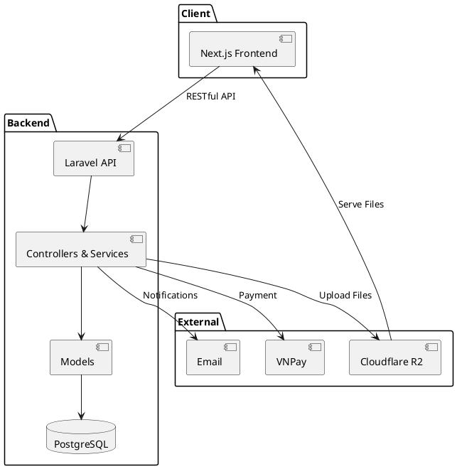
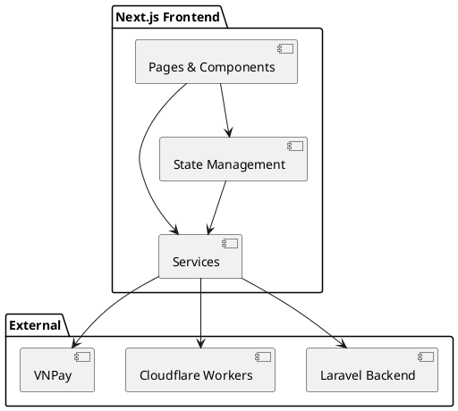
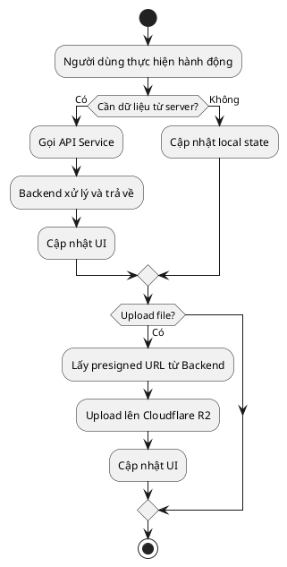
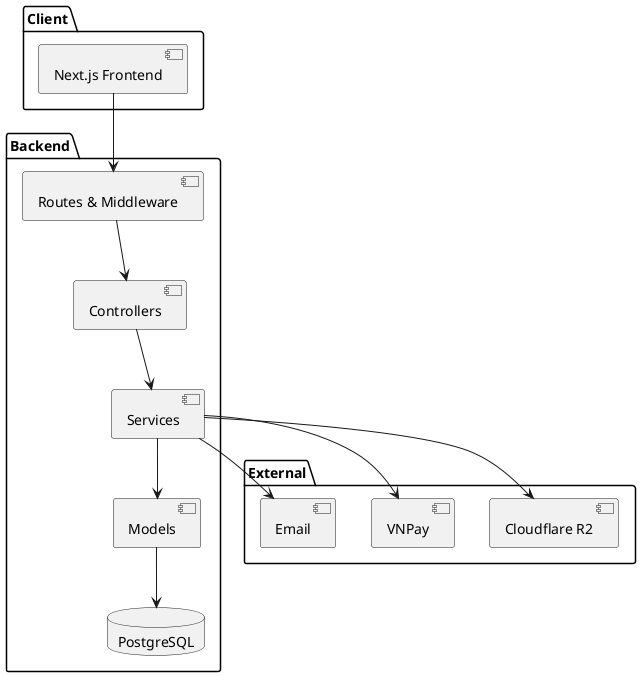
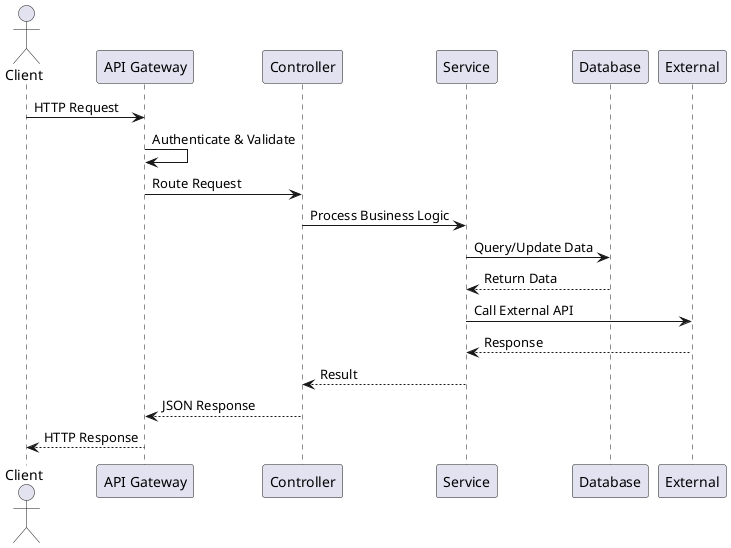

# CHƯƠNG 1: GIỚI THIỆU CHUNG VỀ HỆ THỐNG

## 1.1. Tóm tắt hệ thống

Hệ thống Khởi Trí Số là nền tảng giáo dục trực tuyến toàn diện, quản lý và phân phối khóa học trực tuyến và sách điện tử. Hệ thống sử dụng Laravel 12+ (Backend), Next.js 15+ (Frontend), PostgreSQL, và Cloudflare Workers để cung cấp nền tảng học tập linh hoạt, bảo mật và có khả năng mở rộng cao.

Hệ thống hỗ trợ các chức năng chính: quản lý khóa học và bài giảng video, sách điện tử, câu hỏi và đánh giá, phân quyền đa cấp (Admin, Instructor, Student), thanh toán qua VNPay, lớp học trực tuyến, và báo cáo doanh thu chi tiết.

## 1.2. Mục tiêu và phạm vi dự án

### 1.2.1. Mục tiêu dự án

Các mục tiêu chính của dự án:

- **Tự động hóa quy trình quản lý**: Chuyển đổi các thao tác thủ công sang nền tảng số, giúp giảm thiểu sai sót và tăng hiệu quả làm việc.

- **Nâng cao trải nghiệm học tập**: Cung cấp giao diện trực quan, dễ sử dụng cho học viên và giảng viên.

- **Hỗ trợ ra quyết định kinh doanh**: Tích hợp báo cáo doanh thu chi tiết, thống kê người dùng và phân tích hiệu suất khóa học.

- **Đảm bảo bảo mật**: Triển khai RBAC với 3 vai trò (Admin, Instructor, Student) và các cơ chế bảo mật (Laravel Sanctum, JWT).

- **Khả năng mở rộng**: Thiết kế linh hoạt, tích hợp Cloudflare Workers, VNPay, và hỗ trợ mở rộng trong tương lai.

### 1.2.2. Phạm vi dự án

Các chức năng chính của hệ thống:

- **Quản lý người dùng**: Đăng ký, đăng nhập, xác minh tài khoản, phân quyền (Admin, Instructor, Student).

- **Quản lý khóa học**: Tạo, chỉnh sửa, phê duyệt, xuất bản khóa học với đầy đủ thông tin.

- **Quản lý bài giảng**: Tạo bài giảng video, upload tài liệu học tập qua Cloudflare Workers, sắp xếp bài giảng.

- **Quản lý câu hỏi và đánh giá**: Tạo câu hỏi trắc nghiệm/tự luận, bài tập, chấm điểm tự động và thủ công.

- **Quản lý sách điện tử**: Tạo sách với ISBN tự động, chương sách (hỗ trợ LaTeX), mã kích hoạt.

- **Quản lý đơn hàng và thanh toán**: Giỏ hàng, thanh toán qua VNPay, mã giảm giá, kích hoạt khóa học/sách.

- **Quản lý lớp học trực tuyến**: Tạo lớp học, gửi thông báo tự động, lên lịch nhắc nhở.

- **Quản lý báo cáo và thống kê**: Báo cáo doanh thu chi tiết, thống kê người dùng, phân tích hiệu suất.

- **Quản lý nội dung và SEO**: Danh mục phân cấp, trang tĩnh với SEO tối ưu, cài đặt hệ thống.

**Công nghệ sử dụng**: Laravel 12+ (Backend), Next.js 15+ (Frontend), PostgreSQL, Cloudflare Workers (R2 storage).

### 1.2.3. Công nghệ và kiến trúc hệ thống

Kiến trúc hệ thống client-server với các thành phần:

- **Backend (Laravel 12+)**: Xử lý logic nghiệp vụ, API RESTful, xác thực (Sanctum), ORM (Eloquent).

- **Frontend (Next.js 15+)**: React, SSR/SSG, Tailwind CSS, React Query, Tiptap, Recharts.

- **Database (PostgreSQL)**: Hỗ trợ JSON fields, full-text search, transactions.

- **Cloudflare Workers**: Upload và lưu trữ file trên R2 storage với JWT authentication.

- **VNPay**: Thanh toán trực tuyến với callback verification.

- **Email & Notifications**: Laravel Mail và in-app notifications.

Hệ thống được thiết kế theo nguyên tắc separation of concerns, modularity, và scalability.

## 2.2. Yêu cầu hệ thống

Hệ thống được thiết kế để đáp ứng nhu cầu của ba nhóm người dùng:

- **Học viên (Student)**: Xem khóa học, học video, làm bài tập, đọc sách điện tử, tham gia lớp học trực tuyến, thanh toán.

- **Giảng viên (Instructor)**: Tạo khóa học, upload bài giảng, tạo tài liệu và câu hỏi, chấm điểm, quản lý lớp học, xem báo cáo doanh thu.

- **Quản trị viên (Admin)**: Giám sát toàn bộ hoạt động, quản lý người dùng, phê duyệt khóa học/sách, quản lý danh mục, mã giảm giá, báo cáo tổng hợp.

### 2.2.1. Yêu cầu chức năng

#### 2.2.1.1. Quản lý khóa học và bài giảng

Hệ thống hỗ trợ giảng viên tạo khóa học với đầy đủ thông tin (tiêu đề, mô tả, giá, danh mục), upload hình ảnh/video qua Cloudflare Workers. Giảng viên có thể tạo bài giảng video với nội dung rich text, tài liệu đính kèm (PDF, Word, Excel, PowerPoint, ZIP, hình ảnh, video, audio), và sắp xếp theo thứ tự. Bài giảng đầu tiên tự động được đánh dấu miễn phí.

Hệ thống hỗ trợ quy trình phê duyệt khóa học: quản trị viên xem xét, phê duyệt hoặc từ chối với lý do. Sau khi phê duyệt, giảng viên có thể xuất bản. Hệ thống theo dõi tiến độ học tập của học viên (thời gian học, số bài hoàn thành, điểm số).

#### 2.2.1.2. Quản lý sách điện tử

Tác giả và quản trị viên có thể tạo sách điện tử với thông tin đầy đủ (tiêu đề, mô tả, ISBN tự động, giá, danh mục, hình ảnh bìa). Hệ thống hỗ trợ tạo chương sách với nội dung rich text, hiển thị công thức toán học bằng LaTeX. Mỗi chương có thể chứa nhiều câu hỏi (trắc nghiệm, tự luận) với đáp án, lời giải (LaTeX, video, file), điểm số.

Hệ thống hỗ trợ thanh toán online qua VNPay và thanh toán bằng mã kích hoạt. Khi học viên mua sách, hệ thống tự động tạo và gán mã kích hoạt. Quản trị viên có thể tạo hàng loạt mã kích hoạt, theo dõi trạng thái sử dụng. Hệ thống tự động áp dụng mã giảm giá (phần trăm hoặc cố định) khi thanh toán.

#### 2.2.1.3. Quản lý đơn hàng và thanh toán

Học viên có thể thêm khóa học/sách vào giỏ hàng, áp dụng mã giảm giá, và tạo đơn hàng. Hệ thống hỗ trợ thanh toán trực tuyến qua VNPay với xác thực callback an toàn. Sau khi thanh toán thành công, hệ thống tự động kích hoạt khóa học/sách cho học viên, gửi thông báo xác nhận, và cập nhật số lượng đăng ký.

Quản trị viên có thể xem danh sách đơn hàng, lọc theo trạng thái, xem chi tiết đơn hàng và lịch sử giao dịch. Hệ thống tự động tính toán chiết khấu: 30% cho hệ thống, 70% cho giảng viên, lưu trữ trong mỗi order item để hỗ trợ báo cáo doanh thu.

#### 2.2.1.4. Quản lý câu hỏi và đánh giá

Hệ thống hỗ trợ tạo câu hỏi cho bài học hoặc chương sách (trắc nghiệm, tự luận) với đáp án, lời giải (LaTeX, video, file), điểm số, mức độ khó. Hệ thống hỗ trợ tạo bài tập với nhiều câu hỏi, thời hạn nộp bài, số lần làm lại.

Hệ thống tự động chấm điểm câu hỏi trắc nghiệm và cho phép giảng viên chấm điểm thủ công câu hỏi tự luận với nhận xét. Hệ thống theo dõi các lần làm bài của học viên, tạo báo cáo thống kê (điểm trung bình, tỷ lệ hoàn thành, phân tích câu hỏi khó). Học viên có thể xem lại bài làm với đáp án đúng, lời giải chi tiết (hỗ trợ LaTeX), và nhận xét từ giảng viên.

#### 2.2.1.5. Quản lý lớp học trực tuyến (Live Classes)

Giảng viên có thể tạo lớp học trực tuyến với thông tin đầy đủ (tiêu đề, mô tả, khóa học liên kết, thời gian lên lịch, URL phòng họp, ID và mật khẩu, số lượng người tham gia tối đa, tùy chọn chat, ghi lại buổi học).

Hệ thống tự động gửi thông báo và email cho học viên đã đăng ký khi lớp học được lên lịch, và gửi thông báo nhắc nhở 15 phút trước khi bắt đầu. Tất cả thông báo được lưu trữ trong hệ thống. Giảng viên và quản trị viên có thể theo dõi trạng thái lớp học, số lượng người tham gia, và link ghi lại buổi học.

#### 2.2.1.6. Quản lý báo cáo và thống kê

Dashboard hiển thị các chỉ số hoạt động chính: doanh thu theo ngày/tháng, số lượng đơn hàng, khóa học, sách, học viên đăng ký, hiệu suất khóa học.

Báo cáo doanh thu bao gồm:
- **Báo cáo doanh thu Admin**: Doanh thu từ admin items + chiết khấu 30% từ giảng viên.
- **Báo cáo doanh thu Giảng viên**: Doanh thu gộp, chiết khấu, thu nhập thực tế của từng giảng viên.
- **Báo cáo doanh thu Chi tiết**: Breakdown phí nền tảng và thu nhập giảng viên.
- **Báo cáo doanh thu Tổng hợp**: Tổng hợp doanh thu khóa học và sách.

Hệ thống hỗ trợ thống kê người dùng đăng ký, tiến độ học tập, mức độ tương tác, phân tích hiệu suất khóa học. Các báo cáo được hiển thị dưới dạng biểu đồ trực quan (line chart, bar chart, pie chart).

### 2.2.2. Yêu cầu phi chức năng

- **Hiệu năng**: Hệ thống phải đáp ứng số lượng người dùng truy cập đồng thời cao, đặc biệt trong các giờ cao điểm khi nhiều học viên cùng xem video bài giảng hoặc tham gia lớp học trực tuyến. Hệ thống sử dụng Cloudflare Workers và R2 storage để đảm bảo tốc độ tải nhanh cho các file media.

- **Tính nhất quán (Consistency)**: Dữ liệu phải đảm bảo ACID, đặc biệt trong quy trình đặt hàng, thanh toán và kích hoạt khóa học/sách. Hệ thống sử dụng PostgreSQL với transaction để đảm bảo tính toàn vẹn dữ liệu.

- **Tính sẵn sàng**: Hệ thống hoạt động 24/7, có cơ chế sao lưu và khôi phục dữ liệu định kỳ. Hệ thống sử dụng Cloudflare R2 storage với khả năng sao lưu tự động và CDN toàn cầu.

- **Bảo mật**: Bảo vệ thông tin người dùng, dữ liệu thanh toán và nội dung khóa học có bản quyền. Hệ thống sử dụng Laravel Sanctum cho authentication, JWT cho Cloudflare Workers, và mã hóa dữ liệu nhạy cảm.

- **Khả năng mở rộng**: Cho phép mở rộng thêm tính năng hoặc tích hợp với các dịch vụ bên thứ ba (ví dụ: hệ thống chứng chỉ số, AI cho gợi ý khóa học, chatbot hỗ trợ học viên). Kiến trúc microservices với API RESTful cho phép tích hợp dễ dàng.

- **Khả năng sử dụng (Usability)**: Giao diện người dùng phải trực quan, dễ sử dụng, hỗ trợ đa ngôn ngữ (tiếng Việt, tiếng Anh), và responsive trên nhiều thiết bị (desktop, tablet, mobile).

- **Khả năng bảo trì (Maintainability)**: Code được tổ chức theo mô hình MVC, có documentation đầy đủ, và tuân thủ các coding standards để dễ dàng bảo trì và mở rộng.

## 2.3. Phân tích yêu cầu

*Xem chi tiết các biểu đồ UML trong file [BIEU_DO_UML.md](./BIEU_DO_UML.md)*

Các biểu đồ UML bao gồm:

### 2.3.1. Quản lý khóa học và bài giảng

- **Hình 2.1**: Sơ đồ Use case quản lý khóa học và bài giảng
- **Hình 2.2**: Sơ đồ hoạt động quy trình tạo và phê duyệt khóa học
- **Hình 2.3**: Sơ đồ tuần tự các bước trong quy trình học viên xem khóa học

### 2.3.2. Quản lý sách điện tử

- **Hình 2.4**: Sơ đồ Use case quản lý sách điện tử
- **Hình 2.5**: Sơ đồ hoạt động quy trình tạo và đọc sách điện tử
- **Hình 2.6**: Sơ đồ tuần tự quy trình học viên mua và kích hoạt sách

### 2.3.3. Quản lý đơn hàng và thanh toán

- **Hình 2.7**: Sơ đồ Use case quản lý đơn hàng và thanh toán
- **Hình 2.8**: Sơ đồ hoạt động quy trình đặt hàng và thanh toán
- **Hình 2.9**: Sơ đồ tuần tự quy trình thanh toán qua VNPay

### 2.3.4. Quản lý câu hỏi và đánh giá

- **Hình 2.10**: Sơ đồ Use case quản lý câu hỏi và đánh giá
- **Hình 2.11**: Sơ đồ hoạt động quy trình làm bài tập và chấm điểm
- **Hình 2.12**: Sơ đồ tuần tự quy trình học viên làm bài tập

### 2.3.5. Quản lý lớp học trực tuyến

- **Hình 2.13**: Sơ đồ Use case quản lý lớp học trực tuyến
- **Hình 2.14**: Sơ đồ hoạt động quy trình tạo và tham gia lớp học trực tuyến
- **Hình 2.15**: Sơ đồ tuần tự quy trình tạo và gửi thông báo lớp học

### 2.3.6. Quản lý báo cáo và thống kê

- **Hình 2.16**: Sơ đồ Use case quản lý báo cáo và thống kê
- **Hình 2.17**: Sơ đồ hoạt động quy trình xem báo cáo doanh thu
- **Hình 2.18**: Sơ đồ tuần tự quy trình xem báo cáo doanh thu

## CHƯƠNG 3: XÂY DỰNG VÀ PHÁT TRIỂN HỆ THỐNG

### 3.1. Kiến trúc hệ thống

#### Hình 3.1: Kiến trúc hệ thống

Để đáp ứng yêu cầu của hệ thống, nhóm phát triển xây dựng kiến trúc theo mô hình Client-Server, với sự phân tách rõ ràng giữa giao diện người dùng (frontend) và phần xử lý logic nghiệp vụ cùng quản lý dữ liệu (backend). Frontend được phát triển bằng Next.js 15+ kết hợp React và TypeScript, chịu trách nhiệm hiển thị giao diện, quản lý trải nghiệm người dùng và tương tác với server thông qua các API. Next.js hỗ trợ Server-Side Rendering (SSR) và Static Site Generation (SSG) cho SEO tối ưu, đồng thời cung cấp các tính năng như routing tự động, code splitting, và image optimization, từ đó nâng cao hiệu năng và trải nghiệm người dùng. Các thành phần giao diện được tổ chức dưới dạng component có thể tái sử dụng, trong khi trạng thái dữ liệu được quản lý thông qua React state, Context API, và các thư viện quản lý state, đảm bảo tính nhất quán và dễ mở rộng.

Phần Backend được phát triển bằng Laravel 12+ chạy trên PHP 8.2+, cung cấp các API cho frontend thông qua mô hình RESTful. Laravel đảm nhận việc xử lý toàn bộ logic nghiệp vụ, bao gồm validation dữ liệu, kiểm tra quyền truy cập, và quản lý các thao tác trên cơ sở dữ liệu. Đặc biệt, hệ thống sử dụng Laravel Sanctum để quản lý xác thực và phân quyền, hỗ trợ SPA authentication an toàn và hiệu quả. Các truy vấn dữ liệu được thực hiện thông qua Eloquent ORM và raw SQL queries (cho PostgreSQL), giúp code server trực quan, dễ bảo trì và giảm thiểu lỗi khi tương tác với cơ sở dữ liệu. Công cụ Laravel Artisan được sử dụng trong quá trình phát triển và kiểm thử, giúp nhanh chóng tạo migrations, seeders, và kiểm tra các truy vấn.

Cơ sở dữ liệu của hệ thống sử dụng PostgreSQL, một hệ quản trị cơ sở dữ liệu quan hệ mạnh mẽ với khả năng hỗ trợ JSON fields, full-text search, và transactions phức tạp. Dữ liệu được tổ chức thành các bảng quan hệ với các ràng buộc về khóa chính, khóa ngoại và chỉ mục, nhằm tối ưu hóa hiệu suất truy vấn và bảo toàn tính toàn vẹn dữ liệu. Backend thông qua Eloquent ORM và raw SQL sẽ thực hiện các truy vấn một cách trực quan và an toàn, đồng thời dễ dàng mở rộng khi hệ thống phát triển.

Hệ thống tích hợp Cloudflare Workers để xử lý việc upload và lưu trữ file (hình ảnh, video, tài liệu) trên Cloudflare R2 storage. Workers đảm bảo tính bảo mật thông qua JWT authentication, hiệu năng cao với CDN toàn cầu, và khả năng mở rộng cho việc lưu trữ file. Tất cả các file được upload đều được xử lý qua Workers với khả năng tạo presigned URLs, xác thực signature, và lưu trữ an toàn trên R2.

Luồng dữ liệu trong hệ thống tuân thủ mô hình client-server. Khi người dùng thực hiện các hành động trên giao diện, frontend sẽ gửi request HTTP đến backend. Server kiểm tra và xác thực yêu cầu qua Sanctum, xử lý logic nghiệp vụ, truy vấn cơ sở dữ liệu nếu cần, và trả kết quả về cho client dưới dạng JSON. Đối với việc upload file, frontend sẽ gửi request đến backend để lấy presigned URL từ Cloudflare Workers, sau đó upload trực tiếp lên R2 storage, và xác nhận với backend sau khi hoàn tất. Frontend sau đó nhận dữ liệu và cập nhật giao diện tương ứng, đảm bảo dữ liệu luôn nhất quán, bảo mật và phản hồi nhanh chóng đến người dùng.

### 3.2. Thiết kế cơ sở dữ liệu

Dựa trên quá trình phân tích yêu cầu hệ thống, chúng tôi đã tổng hợp các thông tin về nghiệp vụ, các tương tác giữa người dùng và hệ thống, cũng như các ràng buộc dữ liệu cần thiết. Từ đó, chúng tôi tiến hành xây dựng các biểu đồ UML để làm rõ hơn các quy trình nghiệp vụ, bao gồm Use Case Diagram nhằm minh họa các chức năng chính của hệ thống, Activity Diagram để thể hiện luồng công việc và các quyết định trong từng quy trình, cũng như Sequence Diagram nhằm mô tả chi tiết thứ tự tương tác giữa các thành phần. Các biểu đồ này không chỉ giúp hình dung rõ ràng các yêu cầu nghiệp vụ mà còn làm cơ sở cho việc thiết kế kiến trúc hệ thống và lập kế hoạch triển khai.

Tiếp theo, dựa trên các biểu đồ UML và phân tích mối quan hệ giữa các thực thể, chúng tôi xây dựng lược đồ cơ sở dữ liệu ERD (Entity-Relationship Diagram). Lược đồ ERD thể hiện cấu trúc dữ liệu của hệ thống, các bảng, thuộc tính cũng như mối quan hệ giữa các thực thể, giúp đảm bảo tính toàn vẹn dữ liệu và hỗ trợ hiệu quả cho việc triển khai cơ sở dữ liệu PostgreSQL. Các bảng chính trong hệ thống bao gồm:

- **users**: Quản lý thông tin người dùng (học viên, giảng viên, admin)
- **courses**: Quản lý thông tin khóa học
- **lessons**: Quản lý bài giảng trong khóa học
- **lesson_materials**: Quản lý tài liệu đính kèm bài giảng
- **books**: Quản lý thông tin sách điện tử
- **book_chapters**: Quản lý chương sách
- **questions**: Quản lý câu hỏi cho bài học và chương sách
- **assignments**: Quản lý bài tập
- **user_assignment_attempts**: Quản lý các lần làm bài của học viên
- **orders**: Quản lý đơn hàng
- **order_items**: Quản lý chi tiết đơn hàng
- **coupons**: Quản lý mã giảm giá
- **live_classes**: Quản lý lớp học trực tuyến
- **notifications**: Quản lý thông báo
- **categories**: Quản lý danh mục
- **static_pages**: Quản lý trang tĩnh
- **system_settings**: Quản lý cài đặt hệ thống

Việc kết hợp phân tích nghiệp vụ, biểu đồ UML và ERD tạo nên một nền tảng thiết kế hệ thống toàn diện, từ khâu nghiệp vụ đến dữ liệu, giúp việc triển khai, bảo trì và mở rộng hệ thống trở nên thuận tiện và chính xác hơn.

### 3.3. Thiết kế kiến trúc Frontend

#### Hình 3.3: Mô hình kiến trúc Frontend

Trong mô hình kiến trúc client-server, phần frontend đảm nhận vai trò giao diện người dùng, tương tác trực tiếp với người sử dụng, đồng thời kết nối với backend API thông qua các dịch vụ HTTP. Thành phần frontend được phát triển bằng Next.js 15+ kết hợp React và TypeScript nhằm đảm bảo hiệu năng, khả năng mở rộng, dễ dàng bảo trì và nhất quán trong suốt vòng đời phát triển phần mềm.

Frontend của hệ thống được chia thành ba phân hệ chính:

- **Public Portal**: Giao diện công khai dành cho tất cả người dùng, phục vụ việc xem khóa học, sách điện tử, danh mục, trang tĩnh, và đăng ký/đăng nhập.

- **Student Portal**: Giao diện dành cho học viên, cho phép xem khóa học đã đăng ký, học video bài giảng, làm bài tập, đọc sách điện tử, tham gia lớp học trực tuyến, quản lý đơn hàng và nhận thông báo.

- **Admin/Instructor Portal**: Giao diện dành cho quản trị viên và giảng viên, phục vụ việc quản lý khóa học, sách điện tử, bài giảng, câu hỏi, đơn hàng, mã giảm giá, lớp học trực tuyến, báo cáo doanh thu và thống kê.

Cả ba portal được tích hợp trong cùng một ứng dụng Next.js, nhưng được tách biệt rõ ràng theo routing và middleware nhằm đảm bảo tính độc lập, dễ mở rộng và bảo trì.

Hệ thống frontend sử dụng tập hợp công nghệ hiện đại, được tối ưu cho hiệu năng và khả năng mở rộng:

- **Core Framework**: Next.js 15.5.3, React 19, TypeScript 5.6.2
- **Quản lý trạng thái**: React State, Context API, React Query (Server State)
- **Điều hướng**: Next.js App Router với middleware
- **Giao diện & tạo kiểu**: Tailwind CSS, Heroicons
- **Rich Text Editor**: Tiptap (thay thế react-quill cho React 19 compatibility)
- **Form & xác thực dữ liệu**: React Hook Form, native validation
- **Truy xuất dữ liệu**: Custom HTTP Client với interceptors, Cloudflare Workers integration
- **Biểu đồ & trực quan hóa**: Recharts
- **LaTeX Rendering**: react-katex
- **SEO**: Next.js Metadata API, Open Graph, Twitter Cards, JSON-LD, Sitemap, Robots.txt
- **Công cụ hỗ trợ phát triển**: ESLint, TypeScript, Next.js built-in optimizations

Việc lựa chọn các thư viện và công cụ này nhằm đảm bảo tính ổn định, dễ dàng tái sử dụng, đồng thời tối ưu trải nghiệm người dùng trong cả ba môi trường: công khai, học viên và quản trị.

#### Hình 3.4: Luồng xử lý dữ liệu ở Frontend

Frontend của hệ thống được tổ chức theo mô hình Feature-Based Modular Architecture kết hợp với Layered Architecture. Mỗi tính năng (feature) được quản lý độc lập, đồng thời được chia thành các lớp (layer) rõ ràng:

- **Application Layer**: Quản lý các portal (Public, Student, Admin/Instructor) thông qua Next.js App Router và middleware.

- **Presentation Layer**: Định nghĩa giao diện hiển thị gồm pages (trong thư mục `app/`), layouts, và components (UI components, feature components, shared components).

- **Business Logic Layer**: Xử lý các quy tắc nghiệp vụ thông qua custom hooks, helper functions, và utility functions.

- **State Management Layer**: Quản lý trạng thái ứng dụng thông qua React State, Context API cho global state, và React Query cho server state với caching và synchronization.

- **Data Access Layer**: Chịu trách nhiệm giao tiếp với backend thông qua API services, upload service (tích hợp Cloudflare Workers), và các service modules khác.

Luồng xử lý chính của Frontend:

1. Người dùng thực hiện hành động trên giao diện (UI components).
2. Sự kiện được kích hoạt (Event Handler) và gọi đến React Query hoặc custom hook để xử lý API.
3. Dữ liệu được gửi đến các API Service thông qua HTTP Client có kèm token xác thực (Laravel Sanctum).
4. Backend phản hồi dữ liệu, React Query cập nhật cache, và UI được render lại tức thì (Optimistic Update).
5. Đối với upload file, frontend lấy presigned URL từ backend, upload trực tiếp lên Cloudflare Workers, và xác nhận với backend sau khi hoàn tất.

Luồng này giúp hệ thống đảm bảo phản hồi nhanh, cập nhật dữ liệu tức thời và giảm tải số lượng truy vấn không cần thiết nhờ cơ chế cache thông minh của React Query.

### 3.4. Thiết kế kiến trúc Backend

#### Hình 3.5: Mô hình kiến trúc Backend

Sau khi hoàn tất việc phân tích yêu cầu hệ thống và xây dựng các biểu đồ UML để làm rõ các quy trình nghiệp vụ, nhóm phát triển tiến hành thiết kế kiến trúc tổng thể của hệ thống. Hệ thống Khởi Trí Số được triển khai theo mô hình Client-Server, với phần backend cung cấp RESTful API dựa trên Laravel 12+ và phần frontend là Next.js Web Application. Kiến trúc này cho phép tách biệt rõ ràng giữa giao diện người dùng, logic nghiệp vụ và quản lý dữ liệu, đồng thời đảm bảo khả năng mở rộng, bảo mật và tối ưu hiệu năng.

Trong thiết kế này, các thành phần chính được phân lớp gồm:

- **Client Layer**: Chịu trách nhiệm giao tiếp với người dùng, bao gồm Next.js Frontend và khả năng mở rộng cho Mobile App trong tương lai.

- **API Gateway Layer**: Quản lý routing (Laravel Routes), xác thực (Laravel Sanctum), middleware (authentication, authorization, validation), và CORS configuration.

- **Application Layer**: Chứa controllers xử lý các request từ client, services xử lý business logic phức tạp (UploadService, VNPayService, MessageService), và validators để kiểm tra dữ liệu đầu vào.

- **Domain Layer**: Gồm Models (User, Course, Book, Order, LiveClass, v.v.) và Relationships (Eloquent relationships) để quản lý mối quan hệ giữa các thực thể.

- **Data Layer**: Quản lý PostgreSQL database, file storage thông qua Cloudflare R2 (qua Workers), và các cơ chế caching.

Việc phân lớp này không chỉ giúp hệ thống có cấu trúc rõ ràng, dễ bảo trì mà còn tạo điều kiện thuận lợi cho việc triển khai các biện pháp bảo mật, kiểm thử và tối ưu hiệu suất.

#### Hình 3.6: Sơ đồ tuần tự luồng hoạt động xử lý của Backend

Tiếp theo, hệ thống được phân tích chi tiết qua các core modules, bao gồm:

- **Quản lý người dùng**: Xác thực, phân quyền (Admin, Instructor, Student), quản lý hồ sơ, và theo dõi hoạt động.

- **Quản lý khóa học và bài giảng**: Tạo, chỉnh sửa, phê duyệt, xuất bản khóa học; upload và quản lý bài giảng video; quản lý tài liệu học tập.

- **Quản lý sách điện tử**: Tạo, chỉnh sửa, phê duyệt sách; quản lý chương sách với LaTeX; tạo câu hỏi; quản lý mã kích hoạt.

- **Quản lý đơn hàng và thanh toán**: Xử lý giỏ hàng, tạo đơn hàng, tích hợp VNPay, kích hoạt khóa học/sách, tính toán chiết khấu.

- **Quản lý câu hỏi và đánh giá**: Tạo câu hỏi, bài tập; chấm điểm tự động và thủ công; theo dõi kết quả học tập.

- **Quản lý lớp học trực tuyến**: Tạo, quản lý lớp học; gửi thông báo và email; lên lịch nhắc nhở.

- **Quản lý báo cáo và thống kê**: Báo cáo doanh thu (Admin, Giảng viên, Chi tiết, Tổng hợp); thống kê người dùng; phân tích hiệu suất.

- **Quản lý nội dung**: Quản lý danh mục, trang tĩnh với SEO, cài đặt hệ thống, mã giảm giá.

Mỗi module được thiết kế theo nguyên tắc modular, dễ mở rộng và tái sử dụng, đồng thời kết hợp các design patterns như Service Layer, Repository Pattern (thông qua Eloquent), và Observer Pattern (thông qua Laravel Events) để đảm bảo sự ổn định và linh hoạt trong quá trình phát triển.

Bên cạnh đó, kiến trúc bảo mật được triển khai theo nhiều lớp, từ mạng (HTTPS, CORS, rate limiting), xác thực (Laravel Sanctum, JWT cho Cloudflare Workers), phân quyền (RBAC với 3 vai trò chính) đến ứng dụng (validation, chống XSS, SQL injection, CSRF protection), đảm bảo dữ liệu và nghiệp vụ luôn được bảo vệ toàn diện. Luồng dữ liệu trong hệ thống cũng được chuẩn hóa, với các quá trình read/write operations, file upload qua Cloudflare Workers, và được tối ưu hóa để hỗ trợ hiệu năng cao và khả năng mở rộng sau này.

Nhìn chung, việc thiết kế tổng quan hệ thống dựa trên các biểu đồ UML, ERD và phân tích nghiệp vụ tạo nền tảng vững chắc cho việc triển khai, kiểm thử và vận hành hệ thống một cách hiệu quả, đồng thời đảm bảo khả năng mở rộng trong tương lai.
